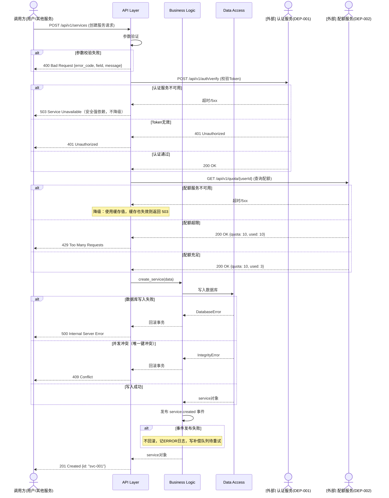

# 4. **内部设计**

## 4.1. **模块划分**

*描述子系统内部如何划分模块*

### 4.1.1. **模块清单**

| 模块名称 | 模块职责 | 主要类/文件 | 代码位置 |
|---|---|---|---|
| API Layer | 处理HTTP请求 | views.py, serializers.py | src/api/ |
| Business Logic | 业务逻辑处理 | service.py, manager.py | src/services/ |
| Data Access | 数据访问 | models.py, repository.py | src/models/ |
| Utils | 工具函数 | utils.py | src/utils/ |

### 4.1.2. **模块依赖关系**

```
┌─────────────┐
│  API Layer  │
└──────┬──────┘
       │
       ▼
┌─────────────────┐
│ Business Logic  │
└──────┬──────────┘
       │
       ▼
┌─────────────────┐
│  Data Access    │
└──────┬──────────┘
       │
       ▼
┌─────────────────┐
│   Database      │
└─────────────────┘
```

## 4.2. **内部流程设计**

*描述子系统内部的关键处理流程，每个接口的增删改查流程如涉及非平凡业务逻辑，均需单独描述。*

<span style="color:red">**[文档拆分规则] 当一个子系统包含超过 2 组增删改查接口（即 2 
个以上独立的资源/业务域）时，说明该子系统职责过重，必须按业务模块拆分为多份子文档：`子系统级设计文档——XX模块.md`。每个子文档独立描述该模块的流程设计、数据结构、异常处理等（结构与本模板一致）。本文档仅保留模块拆分总览和跨模块交互设计。**</span>

<!--
【拆分判断标准】
- ≤ 3 组增删改查接口：在本文档中完整描述所有流程，无需拆分
- > 3 组增删改查接口：必须拆分，示例：
  · 子系统级设计文档——服务管理模块.md（服务的增删改查 + 生命周期管理）
  · 子系统级设计文档——任务调度模块.md（任务的增删改查 + 调度逻辑）
  · 子系统级设计文档——配额管理模块.md（配额的增删改查 + 计费逻辑）

【拆分后本文档保留内容】
- §4.1 模块划分（全局视角）
- §4.2 跨模块交互流程（如有）
- 各子文档的索引清单（见下方模块索引表）
-->

**模块拆分索引（仅拆分时填写，未拆分则删除本表）：**

| 模块名称 | 子文档名称 | 包含的接口/资源域 | 负责人 |
|---|---|---|---|
| *服务管理* | *子系统级设计文档——服务管理模块.md* | *服务增删改查、生命周期* | *张三* |
| *任务调度* | *子系统级设计文档——任务调度模块.md* | *任务增删改查、调度执行* | *李四* |

<span style="color:orange">**[AI可读性要求] 每个流程必须同时包含：①流程图——正常流程和异常分支画在同一张图中，用 alt/else 块表示异常分支（供人看）②详细步骤表格（供AI读，含涉及模块/类/函数名、异常处理）。函数/方法名必须与实际代码一致。流程设计章节不编写代码示例，代码示例仅在§4.3核心算法和公共框架机制中提供。**</span>

### 4.2.1. **流程1：创建服务流程**

**流程描述:**
*用户通过API创建服务的完整流程*

**流程图（含正常流程和异常分支）:**

<span style="color:orange">**[图示规范] 时序图中：本子系统内部模块用 `participant`；外部子系统/服务用 `actor` 或加前缀 `[外部]` 区分。外部调用步骤的箭头注释中写明接口路径和 DEP-XXX 编号。正常流程为主干，异常分支用 `alt/else` 块就地表示，须覆盖：参数校验失败、权限/认证失败、外部依赖不可用、业务逻辑异常（如并发冲突）、部分成功需回滚等场景。每个异常分支需说明错误码和关键处理动作。**</span>



**详细步骤:**

<span style="color:orange">**[填写规范] 步骤类型分两种，用不同标记区分：`[内部]` 表示本子系统内模块间调用；`[外部]` 表示调用其他子系统/服务的接口（必须在 §3.5 中有对应的 DEP-XXX 记录）。外部调用须在"涉及模块/类"列写明 `DEP-XXX` 编号。异常处理列必须写明：错误码、回滚动作、日志级别。**</span>

| 步骤 | 类型 | 处理内容 | 涉及模块/类 | 关键代码/接口 | 异常处理 |
|---|---|---|---|---|---|
| 1 | [内部] | 接收HTTP请求 | API Layer / ServiceView | `create()` | 参数校验失败返回400，ERROR日志 |
| 2 | [内部] | 参数验证 | API Layer / ServiceSerializer | `validate()` | 抛出ValidationError，返回400含具体字段错误 |
| 3 | **[外部]** | 校验用户Token | **DEP-001** / AuthClient | `POST /api/v1/auth/verify` | Token无效返回401；服务不可用返回503（安全强依赖，不降级） |
| 4 | **[外部]** | 检查资源配额 | **DEP-002** / QuotaClient | `GET /api/v1/quota/{userId}` | 超限返回429；服务不可用时使用缓存值，缓存失效返回503 |
| 5 | [内部] | 创建服务记录 | Data Access / ServiceRepository | `create_service()` | 数据库错误回滚事务返回500；唯一键冲突返回409 |
| 6 | [内部] | 初始化任务 | Business Logic / TaskManager | `create_task()` | 任务创建失败：回滚步骤5的服务记录，返回500 |
| 7 | [内部] | 发送事件通知 | Business Logic / EventPublisher | `publish()` | 发送失败不回滚（服务已创建），记ERROR日志，写补偿队列 |
| 8 | [内部] | 返回响应 | API Layer / ServiceView | `Response()` | / |

### 4.2.2. **流程2：【流程名称】**

*按相同格式继续描述其他关键流程，每个流程必须同时包含正常流程图和异常流程图*

## 4.3. **核心算法设计**

*描述子系统中的关键算法*

<span style="color:orange">**[代码示意要求] 本设计文档中仅以下两种场景允许编写代码示例，其他章节一律不编写伪代码或代码片段：
1. **核心算法**：调度算法、分配算法、匹配算法等需要给出完整实现逻辑
2. **公共框架机制**：如果子系统需要提前定义代码结构（如插件机制、事件总线、拦截器链、处理器基类），必须给出类定义和关键方法签名的示例
未涉及的场景标注"不涉及"即可。**</span>

### 4.3.1. **算法1：【算法名称】**

**算法目的:**
*说明该算法要解决什么问题*

**算法描述:**
*用伪代码或流程图描述算法逻辑*

```python
def algorithm_example(input_data):
    """
    算法说明

    Args:
        input_data: 输入数据

    Returns:
        result: 处理结果

    Time Complexity: O(n)
    Space Complexity: O(1)
    """
    # 算法实现
    result = process(input_data)
    return result
```

**性能分析:**

| 场景 | 时间复杂度 | 空间复杂度 | 预期性能 |
|---|---|---|---|
| 最好情况 | O(1) | O(1) | < 10ms |
| 平均情况 | O(n) | O(1) | < 100ms |
| 最坏情况 | O(n^2) | O(n) | < 1s |

### 4.3.2. **公共框架机制（如有）**

<!--
【填写要求】
如果子系统需要定义公共的代码结构、抽象基类、框架机制（如拦截器链、策略模式基类、事件总线等），
在此给出类定义示例，便于团队成员按统一结构开发。不涉及则写明"不涉及"。
-->

**框架说明:**
*说明该框架机制的目的、使用场景*

**类定义示例:**

```python
from abc import ABC, abstractmethod

class BaseHandler(ABC):
    """
    处理器基类 —— 所有业务处理器必须继承此类
    用于统一请求处理链路：参数校验 → 前置检查 → 业务处理 → 后置动作
    """

    @abstractmethod
    def validate(self, request) -> None:
        """参数校验，失败抛出 ValidationError"""
        ...

    @abstractmethod
    def execute(self, request) -> dict:
        """核心业务逻辑，返回处理结果"""
        ...

    def pre_check(self, request) -> None:
        """前置检查（权限、配额等），可选覆盖"""
        pass

    def post_action(self, request, result) -> None:
        """后置动作（审计日志、事件发布等），可选覆盖"""
        pass

    def handle(self, request) -> dict:
        """模板方法，子类不应覆盖"""
        self.validate(request)
        self.pre_check(request)
        result = self.execute(request)
        self.post_action(request, result)
        return result


class CreateServiceHandler(BaseHandler):
    """创建服务处理器 —— 实现示例"""

    def validate(self, request) -> None:
        if not request.get('name'):
            raise ValidationError("name is required")

    def execute(self, request) -> dict:
        service = ServiceRepository.create(request)
        return {'id': service.id, 'status': service.status}

    def post_action(self, request, result) -> None:
        AuditLogger.log('create_service', request, result)
        EventPublisher.publish('service.created', result)
```

## 4.4. **数据结构设计**

*描述子系统使用的关键数据结构*

### 4.4.1. **数据库表设计**

<span style="color:orange">**[AI可读性要求] 直接用 SQL DDL 定义，不用 Markdown 表格。COMMENT 写字段含义，枚举字段列出所有合法值，索引注释说明服务于哪类查询。每张表必须标注所属代码仓库。**</span>

```sql
-- 表：service
-- 用途：存储服务实例信息
-- 所属仓库：repo-service-a
-- 关联状态机：见 openapi.yaml#ResourceStatus

CREATE TABLE service (
  id          VARCHAR(36)   NOT NULL                    COMMENT '服务唯一ID（UUID）',
  name        VARCHAR(100)  NOT NULL                    COMMENT '服务名称，正则：^[a-zA-Z0-9-_]+$',
  description VARCHAR(256)                              COMMENT '服务描述，可为空',
  version     VARCHAR(20)                               COMMENT '服务版本，可为空',
  status      ENUM('disabled','creating','ready','error')
                            NOT NULL DEFAULT 'disabled' COMMENT '服务状态，见openapi.yaml#ResourceStatus',
  config      JSON          NOT NULL DEFAULT '{}'       COMMENT '配置信息，结构见 §4.4.3',
  created_at  DATETIME(3)   NOT NULL DEFAULT CURRENT_TIMESTAMP(3),
  updated_at  DATETIME(3)            ON UPDATE CURRENT_TIMESTAMP(3),

  PRIMARY KEY (id),
  INDEX idx_name       (name)       COMMENT '支持按名称搜索（LIKE查询）',
  INDEX idx_status     (status)     COMMENT '支持按状态过滤列表',
  INDEX idx_created_at (created_at) COMMENT '支持按创建时间排序'
) ENGINE=InnoDB DEFAULT CHARSET=utf8mb4 COMMENT='服务实例主表';


-- 表：task
-- 用途：记录服务的异步操作任务
-- 所属仓库：repo-service-a

CREATE TABLE task (
  id         VARCHAR(36)  NOT NULL                   COMMENT '任务ID（UUID）',
  service_id VARCHAR(36)  NOT NULL                   COMMENT '关联的服务ID，外键→service.id',
  type       ENUM('deploy','update','delete')
                          NOT NULL                   COMMENT '任务类型',
  status     ENUM('pending','running','success','failed')
                          NOT NULL DEFAULT 'pending'  COMMENT '任务状态',
  created_at DATETIME(3)  NOT NULL DEFAULT CURRENT_TIMESTAMP(3),

  PRIMARY KEY (id),
  INDEX idx_service_id (service_id) COMMENT '按service_id查询该服务的任务列表'
) ENGINE=InnoDB DEFAULT CHARSET=utf8mb4 COMMENT='异步任务表';
```

**表关系：**

```
service (1) ──< (N) task        service_id → service.id
```

### 4.4.2. **内存数据结构**

**数据结构1：缓存结构**

```python
class ServiceCache:
    """
    服务缓存结构
    使用LRU策略，最大缓存1000个服务对象
    """
    def __init__(self, max_size=1000):
        self.cache = {}
        self.max_size = max_size
        self.access_order = []

    def get(self, service_id):
        """获取服务"""
        pass

    def set(self, service_id, service):
        """设置服务"""
        pass
```

### 4.4.3. **配置文件结构**

*定义相应的配置文件格式，存储方式，存储路径，各字段代表什么意义*

<span style="color:orange">**[AI可读性要求] 配置文件必须说明：存储路径、格式（yaml/json/ini等）、每个字段的类型/默认值/取值范围/含义。修改某字段是否需要重启服务必须明确标注。**</span>

**配置文件：service_config.yaml**

*存储路径：/etc/service/config.yaml*

```yaml
service:
  name: "service-name"
  port: 8080
  log_level: "INFO"
  database:
    host: "localhost"
    port: 3306
    name: "service_db"
  cache:
    enabled: true
    ttl: 3600
```

**字段说明:**

| 字段名 | 类型 | 默认值 | 取值范围 | 说明 |
|---|---|---|---|---|
| service.name | string | / | / | 服务名称 |
| service.port | int | 8080 | 1-65535 | 服务端口 |
| service.log_level | string | INFO | DEBUG/INFO/WARNING/ERROR | 日志级别 |

