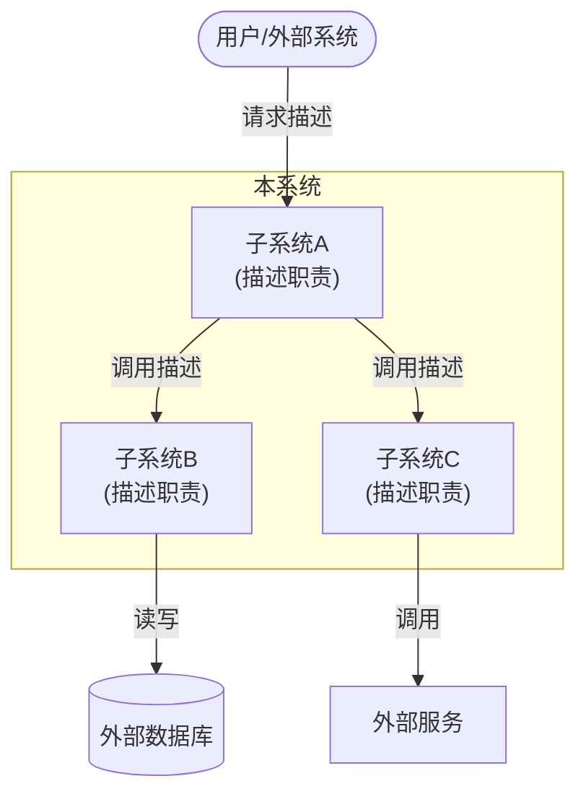

# 2. **系统总体架构**

## 2.1. **系统架构概述**

*描述系统的总体架构，包括：*
- *系统的主要组成部分*
- *系统的部署架构*
- *系统的技术架构*

## 2.2. **子系统划分**

*描述系统如何划分为各个子系统，每个子系统的职责*

### 2.2.1. **子系统清单**

| 子系统名称 | 子系统职责 | 对外提供的主要能力 | 对应代码仓库 |
|---|---|---|---|
| *子系统1* | *该子系统负责什么* | *提供哪些服务或能力* | *repo1, repo2* |
| *子系统2* |  |  |  |

### 2.2.2. **系统架构图** ⭐必填

*展示各子系统之间的关系，以及与外部系统的边界。*

**[必填图示] 使用 Mermaid 或 PlantUML 绘制，禁止只用 ASCII 图代替。图后必须附架构说明文字（AI文字描述）。**

**图示（Mermaid示例，按实际替换）：**

**架构说明（AI文字描述，必须填写）：**

*按以下格式描述架构：*

| 组成部分 | 类型 | 职责 | 与其他部分的关系 |
|---|---|---|---|
| *子系统A* | *内部子系统* | *负责xxx* | *向上接收用户请求，向下调用子系统B* |
| *子系统B* | *内部子系统* | *负责xxx* | *被子系统A调用，读写外部数据库* |
| *外部数据库* | *外部依赖* | *数据持久化* | *被子系统B读写* |

## 2.3. **子系统依赖关系**

*描述子系统之间的依赖关系*

| 子系统 | 依赖的子系统 | 依赖关系说明 | 依赖的接口/能力 |
|---|---|---|---|
| *子系统1* | *子系统2* | *为什么依赖* | *调用了哪些接口* |
| *子系统2* |  |  |  |

## 2.4. **技术选型说明**

*说明系统级的技术选型决策*

| 技术领域 | 技术选型 | 选型理由 |
|---|---|---|
| *前端框架* | *Vue 3* | *理由* |
| *后端框架* | *Django* | *理由* |
| *数据库* | *MySQL* | *理由* |
| *缓存* | *Redis* | *理由* |
| *消息队列* | *RabbitMQ* | *理由* |

