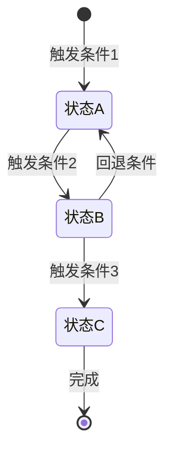
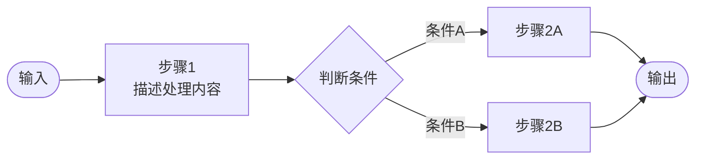

# 3. **系统工作原理**

## 3.0. **工作原理图** ⭐必填

*用一张图说明系统的核心工作原理和关键数据/控制流。与§2.2.2系统架构图的区别：架构图侧重"谁是谁"（静态结构），工作原理图侧重"怎么工作"（动态流程/机制）。*

**[必填图示] 使用 Mermaid 或 PlantUML 绘制。选择最能体现系统核心机制的图类型：流程图（flowchart）、状态图（stateDiagram）、序列图（sequenceDiagram）均可。图后必须附步骤说明（AI文字描述）。**

**图示（Mermaid示例——按实际选择合适图类型）：**

*示例1：流程/状态机类（适合描述生命周期、状态流转）*

*示例2：数据/控制流类（适合描述请求处理链路）*

**工作原理说明（AI文字描述，必须填写）：**

| 序号 | 阶段/步骤 | 说明 | 关键机制/算法 |
|---|---|---|---|
| 1 | *阶段名称* | *该阶段做什么，输入是什么，输出是什么* | *用到什么核心机制* |
| 2 |  |  |  |

## 3.1. **核心设计思路**

*描述系统的主要工作原理，关键需求的设计思路。*

### 3.1.1. **设计原则**

1. *设计原则1：例如，单一职责原则*
2. *设计原则2：例如，高内聚低耦合*
3. *设计原则3：例如，接口隔离原则*

### 3.1.2. **核心机制**

*描述系统的核心机制，例如：*

1. *认证授权机制*
2. *数据同步机制*
3. *任务调度机制*
4. *故障恢复机制*

## 3.2. **关键应用场景实现**

*针对系统需求文档中的关键应用场景，描述如何实现*

### 3.2.1. **场景1：【场景名称】**

**场景描述:**
*引用系统需求文档中的场景描述*

**实现方案:**
*描述该场景涉及哪些子系统，各子系统如何协作*

**关键流程:**
*描述实现该场景的关键流程（详细流程在4.3节给出）*

### 3.2.2. **场景2：【场景名称】**

*继续描述其他关键场景*

