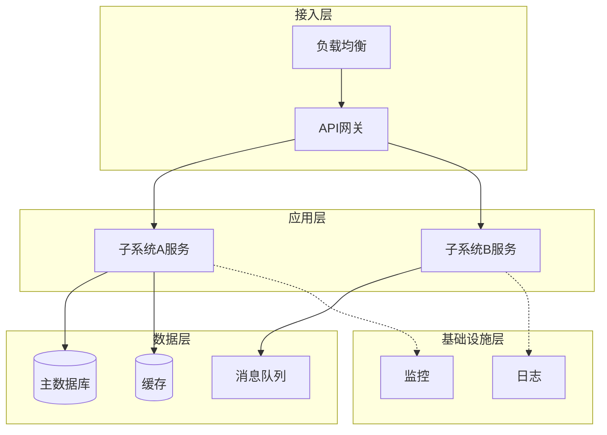
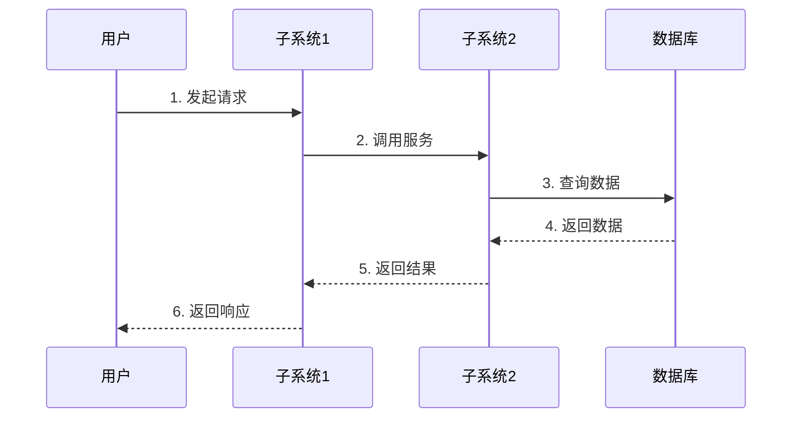
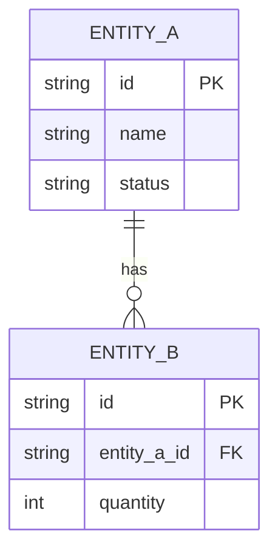

# 4. **概要设计说明**

## 4.1. **方案选型**

*此章节，需要使用方案选型表对核心需求项的多个可行方案进行选型，确定最终采用的实现方案。*

### 4.1.1. **选型1：【选型主题】**

**背景:**
*描述为什么需要进行方案选型*

**备选方案:**

| 方案名称 | 方案描述 | 优点 | 缺点 |
|---|---|---|---|
| 方案1 | *简要描述* | *优点列表* | *缺点和风险* |
| 方案2 | *简要描述* | *优点列表* | *缺点和风险* |

**方案评估:**

| 评估准则 | 权重 | 方案1打分 | 方案1加权得分 | 方案2打分 | 方案2加权得分 |
|---|---|---|---|---|---|
| 性能 | 40% | 5 | 2.0 | 3 | 1.2 |
| 可维护性 | 30% | 3 | 0.9 | 5 | 1.5 |
| 开发成本 | 30% | 4 | 1.2 | 2 | 0.6 |
| **总分** |  |  | **4.1** |  | **3.3** |

**最终选择:**
*方案1，理由是...*

## 4.2. **子系统静态结构图** ⭐必填

*描述系统的软件分层结构，展示各子系统/模块之间的层次和依赖关系。与§2.2.2系统架构图的区别：架构图重在"边界和通信"，静态结构图重在"层次和依赖"。*

<span style="color:orange">**[必填图示] 使用 Mermaid 或 PlantUML 绘制系统分层/组件结构图。如果已有完整的部署架构图（§8.1）可替代本图，则此处写"静态结构见§8.1部署架构图，原因：[说明]"。图后必须附层次说明（AI文字描述）。**</span>

**图示（Mermaid示例——分层结构）：**



**层次说明（AI文字描述，必须填写）：**

| 层次 | 包含组件 | 职责 | 与其他层的关系 |
|---|---|---|---|
| *接入层* | *API网关、负载均衡* | *流量入口、路由、认证* | *向下调用应用层* |
| *应用层* | *各业务子系统* | *业务逻辑处理* | *向上暴露API，向下读写数据层* |
| *数据层* | *数据库、缓存、消息队列* | *数据持久化和异步通信* | *被应用层访问* |

### 4.2.1. **子系统1：【子系统名称】**

**职责定义:**
*详细说明该子系统的职责边界*

**内部模块划分:**

| 模块名称 | 模块职责 | 对外接口 |
|---|---|---|
| *模块1* | *负责什么* | *提供哪些接口* |
| *模块2* |  |  |

**关键数据结构:**
*概要描述该子系统涉及的关键数据结构（详细定义在子系统级设计文档中给出）*

### 4.2.2. **子系统2：【子系统名称】**

*按相同格式继续描述其他子系统*

## 4.3. **子系统间交互流程**

*重点描述子系统之间的交互流程，这是系统级设计的核心内容*

<span style="color:orange">**[AI可读性要求] 每个流程必须同时包含：①ASCII时序图（供人看）②步骤说明表格（供AI读）。步骤说明表格必须写明每步的调用方、被调方、接口名称、传递的关键参数和可能的异常。接口调用必须使用标准格式引用：`接口名 (HTTP方法 路径)，详见《API Schema文档》§X.X.X`。**</span>

### 4.3.1. **流程1：【流程名称】**

**流程描述:**
*简要说明该流程实现什么功能*

**涉及的子系统:**
*列出参与该流程的所有子系统*

**流程时序图:**



**关键步骤说明:**

| 步骤 | 说明 | 异常情况 | 异常处理 |
|---|---|---|---|
| 1 | *用户发起请求* | *请求参数不合法* | *返回错误提示* |
| 2 | *子系统1调用子系统2* | *子系统2不可用* | *返回错误并记录日志* |
| 3-6 | *数据查询和返回* | *数据库连接失败* | *重试机制* |

**接口调用关系:**

| 调用方 | 被调用方 | 接口名称 | 接口说明 |
|---|---|---|---|
| 子系统1 | 子系统2 | GET /api/xxx | *查询xxx信息* |

*详细的接口定义参见API schema文档*

### 4.3.2. **流程2：【流程名称】**

*继续描述其他关键流程*

## 4.4. **数据流转**

*描述系统中关键数据的流转过程*

### 4.4.1. **数据流向图**

*画出数据在各子系统间的流向*

```
数据源 -> 子系统1(数据采集) -> 子系统2(数据处理) -> 子系统3(数据存储) -> 数据消费方
```

### 4.4.2. **数据一致性保证**

*说明如何保证跨子系统的数据一致性*

1. *一致性机制1：例如，分布式事务*
2. *一致性机制2：例如，最终一致性*

## 4.5. **系统数据架构** ⭐必填

*描述系统级的概念数据模型：核心实体、实体间关系、数据归属（哪个子系统是 SSOT）、跨子系统数据流向。*
*不描述物理表结构——物理 DDL 见各子系统级设计文档 §4.4。*

<span style="color:orange">**[AI可读性要求] 本节必须同时包含：①实体关系图（Mermaid ER图）②数据归属边界表③跨子系统数据流说明。三者缺一不可。**</span>

### 4.5.1. **核心实体关系图** ⭐必填

*展示系统全局核心实体及其关系。*

<span style="color:orange">**[必填图示] 使用 Mermaid erDiagram 绘制，禁止用 ASCII 代替。图后必须附实体说明表。**</span>

**图示（Mermaid示例，按实际替换）：**



**实体说明（AI文字描述，必须填写）：**

| 实体 | 归属子系统（SSOT） | 核心属性（3-5个） | 数据量级估计 |
|---|---|---|---|
| *实体A* | *子系统1* | *id, name, status* | *万级* |
| *实体B* | *子系统2* | *id, entity_a_id, quantity* | *百万级* |

### 4.5.2. **数据归属边界**

*说明每类核心数据由哪个子系统作为 Single Source of Truth（SSOT），其他子系统如何读取。*

| 数据类型 | SSOT 子系统 | 其他子系统读取方式 | 读取延迟容忍 |
|---|---|---|---|
| *数据类型A* | *子系统1* | *API 调用 GET /api/xxx* | *实时* |
| *数据类型B* | *子系统2* | *事件订阅（MQ topic）* | *最终一致，< 1min* |

### 4.5.3. **跨子系统数据流**

*描述核心数据在子系统间的流转路径：写入链路、同步机制、一致性策略。*

| 数据流 | 写入方 | 同步方式 | 消费方 | 一致性策略 |
|---|---|---|---|---|
| *数据流1* | *子系统A* | *同步 API 调用* | *子系统B* | *强一致* |
| *数据流2* | *子系统A* | *MQ 异步事件* | *子系统C* | *最终一致* |

