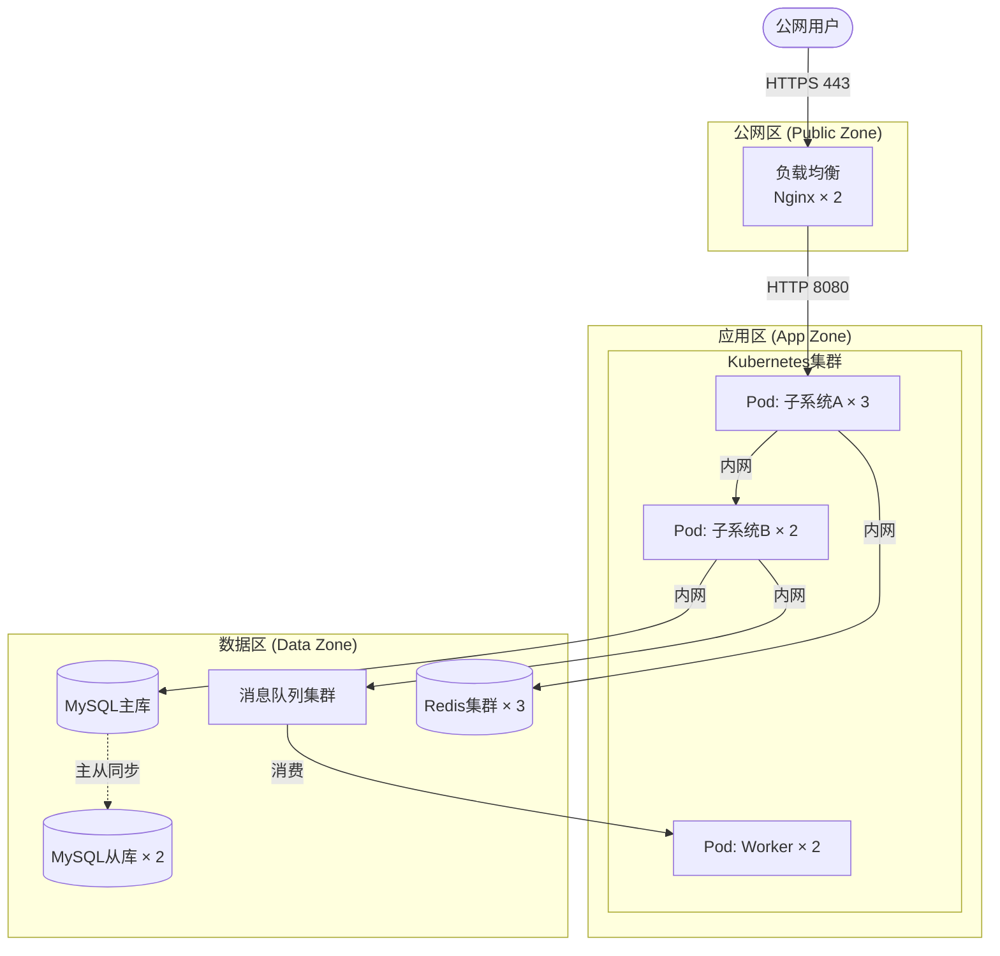

# 8. **部署视图**

## 8.1. **部署架构图** ⭐必填

*展示系统在实际运行环境中的物理/逻辑部署结构，包括节点、网络区域、容器编排等。*

**[必填图示] 使用 Mermaid 或 PlantUML 绘制。需体现：网络区域划分（公网/DMZ/内网）、节点类型和数量、高可用部署方式（主备/集群）。图后必须附部署说明表（§8.2）。**

**图示（Mermaid示例，按实际替换）：**

**部署说明（AI文字描述，必须填写）：**

*描述网络区域划分、高可用策略、关键节点说明*

1. **网络分区：** *[说明公网区/应用区/数据区的划分及隔离方式]*
2. **高可用策略：** *[说明各关键组件的冗余/集群策略]*
3. **网络访问控制：** *[说明哪些区域间允许通信，通过什么端口]*

## 8.2. **部署说明**

| 组件 | 部署方式 | 实例数量 | 资源配置 |
|---|---|---|---|
| *Web服务器* | *容器部署* | *2+* | *2C4G* |
| *应用服务* | *容器部署* | *3+* | *4C8G* |
| *数据库* | *虚拟机* | *1主2从* | *8C16G* |

