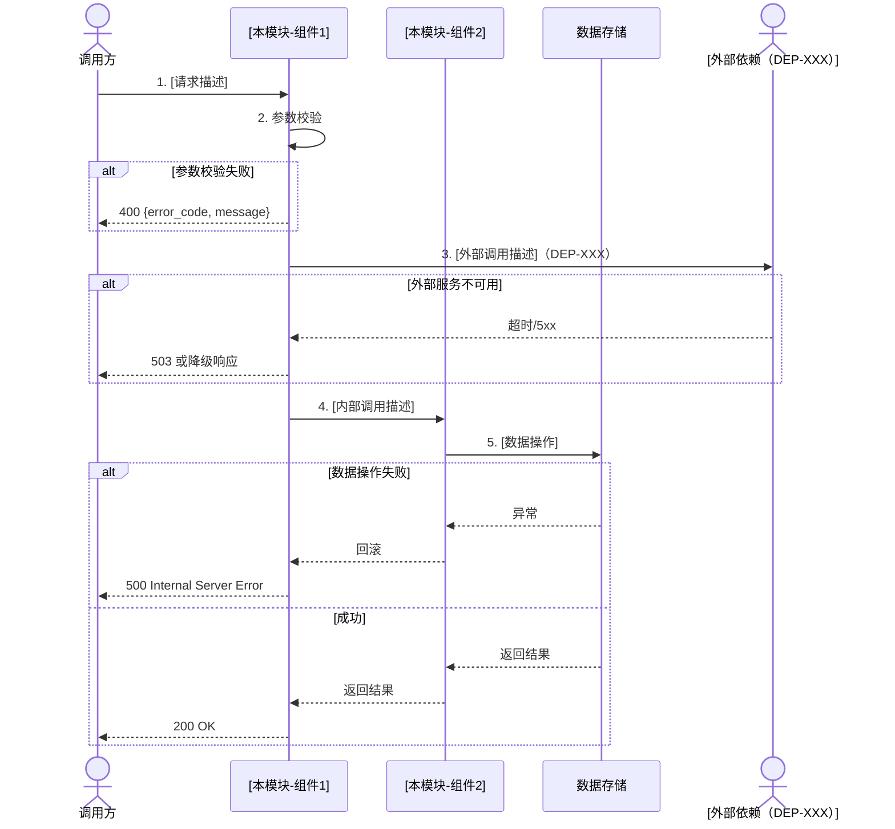

# [产品名称] v[版本号] [模块名称] 微型设计说明书

> **[AI读取引导]** 本文档描述单个模块的小规模改动设计，是辅助编码和代码评审的核心参考文档。AI 读取本文档可获取：改动目的与方案、修改位置与方法、接口/数据结构变更、异常处理策略、关联影响分析、关键测试用例。**本文档不包含**完整子系统架构设计（见子系统级设计文档）和跨子系统交互设计（见系统级设计文档）。

---

## 高密度摘要

> **[抗上下文衰减]** 本节是全文关键信息的前置索引。

**改动类型：** ☐ 补丁/移植型（Bug 修复、补丁合入、参数调整）/ ☐ 功能型（小功能新增或现有功能调整）

> **[选型说明]** 根据改动类型选择 §3 的填写路径：
> - **补丁/移植型** → 填写 §3.1 修改明细表，§3.2 可跳过
> - **功能型** → 填写 §3.2 功能型改动设计，§3.1 可跳过
> - **混合型** → 两者均填写

**改动一句话描述：** *[如：修复高并发下文件描述符泄露问题 / 新增 XXX 功能的 API 接口]*

**涉及模块/文件：** *[模块名 + 文件路径，如：防火墙模块 /daemon/fw/fwserver.c]*

**全局强约束（必须遵守）：**
- **必须**：所有章节不得为空；如不涉及须说明原因
- **必须**：§4 关联分析不得省略，即使认为"无影响"也须显式说明分析过程
- **必须**：验证点/验证案例须客观可执行（可用 ✅/❌ 判定）
- **禁止**：用本文档替代需要做概要设计的较大功能改动

---

# 1. 介绍

## 1.1 目的

*简要说明设计或修改该模块的目的，本文档要解决的主要问题，以及使用该文档的对象和各对象需要关注的内容。*

## 1.2 定义和缩写

> **[AI可读性要求]** 本节必须填写完整。所有缩写和领域术语须定义，一个概念只有一个名称。

| 缩写/术语 | 定义 | 备注 |
|---|---|---|
| *[缩写]* | *[定义]* | |

## 1.3 参考和引用

1. *《系统需求文档》— REQ-XXX：[需求名称]*
2. *《系统级设计文档》— §X.X：[章节名称]*
3. *《[模块名]概要设计说明书》— §X.X（如有）*
4. *[其他参考文档，如 Bug 单链接、技术调研报告]*

---

# 2. 模块方案概述

> **[本章要点]** 说清楚"改什么、为什么改、怎么改"。如有多个候选方案，须用方案选型表给出决策依据，版本经理/开发经理认可后才能开始详细设计。

## 2.1 改动背景与目标

**问题描述：** *[描述当前存在的问题或待实现的需求，引用需求/Bug 编号]*

**改动目标：**

| 目标项 | 描述（量化） |
|---|---|
| *[功能目标]* | *[如：修复文件描述符泄露，确保长期运行后描述符数量稳定]* |
| *[性能目标]* | *[如：接口响应时间 p99 < 200ms，当前为 800ms]* |
| *[质量目标]* | *[如：消除高危漏洞 CVE-XXXX-XXXX]* |

## 2.2 方案设计

*描述本改动的实现原理和方案思路。如有多个候选方案，使用下方选型表进行决策。*

**方案描述：** *[描述选定方案的核心实现思路]*

**方案选型（如有多个候选方案）：**

| 评估准则 | 权重 | 方案1：[名称] | 方案2：[名称] | 给分依据 |
|---|---|---|---|---|
| *[准则1，如：改动范围最小]* | 40% | *[1-5分]* | *[1-5分]* | *[说明]* |
| *[准则2，如：可靠性]* | 30% | | | |
| *[准则3，如：可维护性]* | 30% | | | |
| **加权总分（满分5分）** | | | | |

| 方案 | 优点 | 风险和缺点 | 最终选择 |
|---|---|---|---|
| 方案1 | | | ☐ |
| 方案2 | | | ☐ |

## 2.3 方案对现有设计的影响概述

*从整体视角说明本次改动对现有功能/接口/数据结构的影响范围（详细分析见 §4）。*

*[如：仅修改 send_rule 函数内部逻辑，不涉及接口变更和数据结构调整；关联的配置下发流程需要回归验证]*

---

# 3. 模块详细设计

> **[填写说明]** 根据 §高密度摘要 中选择的改动类型，选择对应路径填写：
> - **补丁/移植型** → 填 §3.1，§3.2 写"不涉及（补丁型改动）"
> - **功能型** → 填 §3.2，§3.1 写"不涉及（功能型改动）"

---

## 3.1 补丁/移植型修改明细

> **[适用场景]** Bug 修复、安全补丁合入、参数边界调整、移植性修改等改动范围明确、逻辑简单的变更。

| 修改目的 | 修改位置（模块名 + 文件名 + 函数名） | 修改方法 | 影响流程 | 验证点/验证案例 |
|---|---|---|---|---|
| *[如：修复文件描述符泄露 Bug#13245]* | *防火墙模块：/daemon/fw/fwserver.c : send_rule* | *下发完毕后关闭文件描述符，防止泄露* | *配置下发* | *反复下发 100 次，检查进程占用的文件描述符数量不增长* |
| *[如：修复规则数越界]* | *防火墙模块：/daemon/fw/fwserver.c : read_conf* | *读取规则数后校验，保证规则数在 [1, 200) 之间* | *程序最大规则数* | *手工修改配置文件，分别配置 199 条和 200 条测试边界* |
| | | | | |

---

## 3.2 功能型改动设计

> **[适用场景]** 小功能新增、现有功能调整、接口扩展等需要描述实现逻辑的改动。按需填写以下各节，不涉及的节须注明"不涉及"及原因。

### 3.2.1 接口变更（如有）

> **[填写说明]** 仅列出本次新增或变更的接口，不变更的接口无需列出。详细参数定义见 API Schema 文档。

**新增接口：**

| 接口名称 | 路径 | 方法 | 功能说明 | OpenAPI 定义位置 |
|---|---|---|---|---|
| *[接口名]* | *[/api/v1/xxx]* | *GET/POST/...* | *[功能描述]* | *openapi.yaml#/paths/...* |

**变更接口（仅说明变更内容）：**

| 接口名称 | 变更类型 | 变更内容 | 向后兼容性 |
|---|---|---|---|
| *[接口名]* | *[新增字段/修改字段/废弃字段]* | *[如：新增可选字段 timeout，默认值 30s]* | *[兼容/不兼容（说明原因）]* |

**消息接口变更（如有）：**

| 消息名称 | 方向 | 变更内容 | Schema 定义位置 |
|---|---|---|---|
| *[消息名]* | *发布/订阅* | *[变更描述]* | *openapi.yaml#/components/schemas/...* |

---

### 3.2.2 内部流程设计（如有）

> **[填写规范]** 流程图须在同一张图中包含正常流程和关键异常分支（用 alt/else 块）。步骤说明表中用 `[内部]` / `[外部]` 区分调用类型，异常处理列须写明错误码和处理动作。

#### 3.2.2.1 [流程名称]

**流程描述：** *[简要说明该流程实现什么功能，与现有流程的差异]*

**流程图（正常流程 + 异常分支）：**



**详细步骤说明：**

| 步骤 | 类型 | 处理内容 | 涉及模块/函数 | 异常处理（错误码 + 处理动作） |
|---|---|---|---|---|
| 1 | [内部] | *[接收请求，描述处理内容]* | *[模块名 / 函数名]* | *[如：参数非法返回 400，记 WARN 日志]* |
| 2 | [内部] | *[参数校验]* | *[函数名]* | *[校验失败返回 400 含字段详情]* |
| 3 | **[外部]** | *[外部调用描述]* | *[DEP-XXX / 调用方法]* | *[超时重试 N 次；不可用时降级/返回 503]* |
| 4 | [内部] | *[业务逻辑处理]* | *[函数名]* | *[异常回滚事务，返回 500]* |

#### 3.2.2.2 [流程名称2]（如有）

*按 §3.2.2.1 格式描述*

---

### 3.2.3 数据结构变更（如有）

> **[填写说明]** 数据库变更用 SQL DDL 描述（含 COMMENT），配置文件变更用 YAML/JSON 描述，内存数据结构用代码片段描述。未变更的数据结构无需列出。

#### 3.2.3.1 数据库 Schema 变更

> **[填写规范]** 直接用 SQL DDL 定义，COMMENT 写字段含义，枚举字段列出所有合法值，新增索引须注释说明服务于哪类查询。

```sql
-- 变更类型：新增表 / 新增字段 / 修改字段 / 新增索引
-- 变更说明：[一句话说明变更目的]
-- 所属仓库：[repo 名称]
-- 回滚脚本：[见下方 ROLLBACK 注释]

-- ========== 变更脚本 ==========

ALTER TABLE [表名]
  ADD COLUMN [字段名] [类型] NOT NULL DEFAULT [默认值] COMMENT '[字段含义]'
    AFTER [前一字段];

CREATE INDEX idx_[字段名] ON [表名]([字段名])
  COMMENT '[说明此索引服务于哪类查询]';

-- ========== 回滚脚本 ==========
-- ALTER TABLE [表名] DROP COLUMN [字段名];
-- DROP INDEX idx_[字段名] ON [表名];
```

**表关系变更（如有）：**

```
[变更前] table_a (1) ──< (N) table_b    外键：b.a_id → a.id
[变更后] table_a (1) ──< (N) table_b    （同上，新增 table_c）
         table_a (1) ──< (N) table_c    外键：c.a_id → a.id
```

#### 3.2.3.2 配置文件变更（如有）

> **[填写规范]** 须说明：存储路径、变更字段类型/默认值/取值范围/含义；修改该字段是否需要重启服务须明确标注。

**配置文件路径：** *[/etc/xxx/config.yaml]*

```yaml
# 新增/修改的配置项（其余字段不变）
[模块名]:
  [新增字段名]: [示例值]   # 类型: [类型]，默认: [默认值]，取值范围: [范围]，修改后需重启: [是/否]
```

| 字段名 | 变更类型 | 类型 | 默认值 | 取值范围 | 含义 | 修改需重启 |
|---|---|---|---|---|---|---|
| *[字段名]* | 新增/修改/废弃 | *[string/int/bool]* | *[默认值]* | *[范围]* | *[含义]* | 是/否 |

#### 3.2.3.3 内存数据结构变更（如有）

*描述新增或变更的内存数据结构（缓存结构、队列结构等）。*

```python
# 示例：新增缓存结构
class XxxCache:
    """
    [说明该数据结构的用途和生命周期]
    """
    # 字段和方法定义
```

---

### 3.2.4 异常处理设计（如有）

*描述本次改动新增或变更的异常处理策略。*

| 异常场景 | 触发条件 | 影响范围 | 处理策略 | 错误码 | 恢复方式 |
|---|---|---|---|---|---|
| *[如：外部服务超时]* | *[如：调用 DEP-001 超过 5s]* | *[如：单次请求]* | *[如：重试 3 次，指数退避；失败后返回 503]* | *503* | *[依赖服务恢复后自动正常]* |
| *[如：并发冲突]* | *[如：同一资源并发修改]* | *[单次请求]* | *[返回 409，提示重试]* | *409* | *[重新获取最新数据后重试]* |

**降级策略（如有）：**

| 降级场景 | 降级策略 | 对用户的影响 |
|---|---|---|
| *[如：缓存不可用]* | *[如：直接查询数据库]* | *[性能下降，功能不受影响]* |

---

# 4. 关联分析

> **[必须填写]** 分析并梳理改动对已有功能的影响。即使负责人认为没有影响，也须显式写明分析过程和结论，不能省略。

## 4.1 功能影响分析

*分析本改动对现有功能的影响，包括：依赖或被依赖的功能、数据结构变更的影响场景、调用链上下游的影响等。*

| 影响类型 | 受影响模块/功能 | 影响描述 | 处理方式 | 是否需要回归测试 |
|---|---|---|---|---|
| *[如：接口变更影响调用方]* | *[如：前端 XXX 页面]* | *[如：新增字段，调用方需更新处理逻辑]* | *[如：已与前端确认，兼容旧格式]* | 是/否 |
| *[如：数据结构变更]* | *[如：查询列表接口]* | *[如：新增索引，查询性能影响需验证]* | *[如：压测验证]* | 是/否 |
| *[无影响项]* | *[如：告警模块]* | *[分析：本次改动不涉及告警触发逻辑，无影响]* | 无需处理 | 否 |

## 4.2 DFX 影响评估

> **[填写说明]** 逐项评估本次改动是否影响各 DFX 维度，受影响的项须说明处理方式。

| DFX 维度 | 是否受影响 | 影响说明 | 处理方式 |
|---|---|---|---|
| 安全性 | ☐ 是 / ☐ 否 | *[如：新增接口须鉴权]* | *[如：已在 §3.2.1 接口中标注权限要求]* |
| 可靠性 | ☐ 是 / ☐ 否 | *[如：新增重试逻辑，可能影响超时表现]* | *[如：已在 §3.2.4 中定义退避策略]* |
| 性能 | ☐ 是 / ☐ 否 | *[如：新增数据库查询]* | *[如：已添加索引，见 §3.2.3.1]* |
| 可运维性 | ☐ 是 / ☐ 否 | *[如：新增配置项]* | *[如：已在 §3.2.3.2 定义配置说明]* |
| 可测试性 | ☐ 是 / ☐ 否 | *[如：新增外部依赖，影响 Mock]* | *[如：已提供 Mock 接口]* |
| 兼容性 | ☐ 是 / ☐ 否 | *[如：接口字段变更]* | *[如：向后兼容，旧字段保留]* |
| 隐私/数据安全 | ☐ 是 / ☐ 否 | *[如：新增采集用户行为数据]* | *[如：已脱敏处理，见 §3.2.4]* |

---

# 5. 关键测试用例

> **[本章要点]** 每个测试用例须对应 §3 中的具体改动，可执行（有前置条件、输入/步骤、预期结果和自动化方式），并能被后续实施计划直接转成测试代码。禁止只写测试点名称或“验证功能正常”。

## 5.1 功能测试用例

| 用例编号 | 用例名称 | 类型 | 前置条件/测试数据 | 操作步骤/输入 | 预期结果/断言 | 自动化方式 | 关联改动 |
|---|---|---|---|---|---|---|---|
| TC-001 | *[测试用例名称]* | 正常 | *[前置条件、数据准备]* | *1. [操作步骤]<br>2. [验证步骤]* | *[预期结果（量化）；关键字段/状态断言]* | 单元/集成/API/E2E/手工（说明原因） | §3.1 / §3.2.x |
| TC-002 | *[边界场景]* | 边界 | *[边界输入]* | *[步骤]* | *[预期结果]* | | |

## 5.2 回归测试用例

*本次改动需要回归验证的现有功能（来自 §4.1 关联分析）。*

| 用例编号 | 回归场景 | 前置条件/测试数据 | 操作步骤 | 通过标准/断言 | 自动化方式 | 关联影响项 |
|---|---|---|---|---|---|---|
| RT-001 | *[受影响的现有功能]* | *[数据准备]* | *[步骤]* | *[标准]* | 单元/集成/API/E2E/手工（说明原因） | §4.1 |

## 5.3 异常/边界测试用例

| 用例编号 | 类型 | 异常/边界场景 | 前置条件/输入 | 操作步骤 | 预期结果/断言 | 自动化方式 |
|---|---|---|---|---|---|---|
| ET-001 | 边界 | *[如：规则数边界值 199 条]* | *[输入]* | *[步骤]* | *[如：成功，不报错]* | |
| ET-002 | 异常 | *[如：规则数边界值 200 条]* | *[输入]* | *[步骤]* | *[如：返回错误，提示超限，状态未改变]* | |

---

# 6. 变更控制

## 6.1 变更列表

*在编码过程中如有设计调整，须在此记录并经版本经理/开发经理确认后生效。需求变更引起的设计变更也须在此说明。*

| 变更章节 | 变更内容 | 变更原因 | 对旧功能/原有设计的影响 | 确认人/日期 |
|---|---|---|---|---|
| | | | *需与开发经理、架构师、老版本开发人员沟通确认后评审* | |

---

## 附录：文档完成自检清单

> **[使用说明]** 文档提交评审前逐项检查。⭐ 项为必检项。

### 内容完整性
- [ ] ⭐ 所有章节已填写，或已注明"不涉及"及原因
- [ ] ⭐ §高密度摘要：改动类型已选择（补丁型/功能型），路径选择正确
- [ ] ⭐ §4.1 关联分析：已逐项分析影响，"无影响"项已写明分析过程
- [ ] ⭐ §4.2 DFX 影响：已逐项评估，受影响项已说明处理方式
- [ ] ⭐ §5 所有测试用例可执行（有前置条件、输入/步骤、预期结果、自动化方式）

### 补丁/移植型改动（如适用）
- [ ] §3.1 每行均填写：修改位置精确到函数名
- [ ] §3.1 每行均有：验证点/验证案例（可操作的步骤）
- [ ] §3.1 影响流程列：已覆盖所有关联流程

### 功能型改动（如适用）
- [ ] §3.2.1 接口变更：向后兼容性已明确说明
- [ ] §3.2.2 流程图：包含正常流程和关键异常分支（alt/else 块）
- [ ] §3.2.2 步骤说明表：内部/外部调用已区分标注
- [ ] §3.2.3 数据库变更：提供回滚脚本
- [ ] §3.2.3 配置变更：字段含义和是否需要重启已明确
- [ ] §3.2.4 新增异常处理：包含错误码和降级策略

### 评审准备
- [ ] 方案选型（如有）：已经版本经理/开发经理认可
- [ ] §4.1 受影响团队：已沟通确认（如涉及跨团队影响）
- [ ] §6 变更控制：编码完成后已更新并补充确认人
