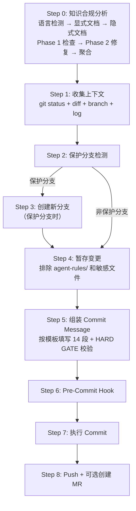

# Git Commit Specification & Execution

## Skill 标识

- Skill name: `spec-commit`
- Plugin: `cospowers-tdd-development`
- Scope: Independent split plugin package `cospowers-tdd-development-plugin`
- Entry skill: `tdd-implementation`


**Skill 标识**: `spec-commit`

其他 skill 通过 `spec-commit` 引用本 skill。当本插件入口或 `executing-plans` 等 skill 要求"所有 git commit 必须走 spec-commit"时，即调用本 skill 并按以下完整流程执行。

## Purpose

Provide a **one-stop AI-Native Git commit capability** that unifies commit specification and execution workflow. When a user requests a code commit, the AI automatically completes change analysis, specification checks, branch management, commit operations, push handling, and optional MR creation.

**Does not include**: Extended tag rules for specific workflows (such as SPEC's AI-SPEC-FIRST), time tracking and other extended logic — those are provided by role extensions.

## Extension Points

Before starting, read `cospowers.config.json` from the plugin root (2 levels above this skill's base directory — the directory shown in "Base directory for this skill" at skill load time). No fallback needed — the config always has valid defaults.

| Config field | Used for |
|---|---|
| `config.env.DAEDALUS_URL` | Compliance check service URL for Step 0; null = skip Step 0 |
| `config.env.DAEDALUS_API_KEY` | API key sent as `X-API-Key` header to `DAEDALUS_URL` |
| `config.project.product` | Product identifier (e.g., SCC, SCP, DMP) |
| `config.env.GITLAB_TOKEN` | GitLab personal access token for Step 8 MR creation |
| `config.env.GITLAB_TOKEN_PATH` | Path to JSON file containing GitLab token |

For `GITLAB_TOKEN` / `GITLAB_TOKEN_PATH`: config takes priority over OS env var, which takes priority over `~/.qianliu/config.json`.

---

## When to Activate

当用户发出以下意图时自动激活：

- "帮我提交代码" / "commit 一下"
- "推送到远程" / "push 代码"
- "创建分支" / "切个分支"
- "创建合并请求" / "创建 MR" / "提交 MR" / "create MR"
- "submit for review" / "提交评审"
- "Help me commit code" / "commit this" / "Push to remote"
- 任何涉及 git commit / git push / merge request 的请求

---

## Part 1: Specification Baseline

### Protected Branch Definition

**Protected branch list** (direct commits and pushes prohibited):
- `main`
- `master`
- `develop`
- `release/*`
- `m-feature-*` (integration branches, equivalent to protected branches)

**Detection method**:
```bash
# Get current branch name
current_branch=$(git branch --show-current)
```

**Detection logic** (must be strictly enforced):
```
If current_branch matches any of the following patterns -> classified as protected branch:
  - main
  - master
  - develop
  - release/*
  - m-feature-*
Classified as protected branch -> must create a new branch before committing
```

If the current branch is a protected branch, you **must** create a new branch before committing.

### Branch Naming Convention

| Current Branch | New Branch Naming Format |
|----------|----------------|
| m-feature-xxx | feature-xxx-custom-name |
| develop | develop-custom-name |
| master | master-custom-name |
| release/* | release-custom-name |
| main | main-custom-name |

**"custom-name"** should be an auto-generated meaningful English short name (kebab-case) based on the core content of the change, e.g., `fix-login-timeout`, `add-permission-check`.

#### Branch Name Length Limit

**Hard rule: Total branch name length must not exceed 50 characters.**

When exceeding 50 characters, you **must abbreviate the "custom-name" portion** with these strategies:
1. Keep only core verb + key noun, remove modifiers (e.g., `with-pagination-and-filtering-support` -> `pagination`)
2. Use abbreviations (e.g., `config` -> `cfg`, `permission` -> `perm`, `validation` -> `val`)
3. Keep at most 2-3 kebab segments (e.g., `add-user-export` not `add-user-export-with-csv-format`)

```bash
# Branch name length validation (must execute before creation)
BRANCH_NAME="<generated-branch-name>"
if [ ${#BRANCH_NAME} -gt 50 ]; then
  echo "ERROR: Branch name '${BRANCH_NAME}' length is ${#BRANCH_NAME}, exceeds 50 char limit, must abbreviate"
  # Abbreviate and reassign BRANCH_NAME, validate again
fi
```

Examples:
- `feature-v1.1.0-add-user-export` (31 chars) OK
- `feature-v1.1.0-add-user-export-with-pagination-and-filtering` (61 chars) BAD -> abbreviate to `feature-v1.1.0-add-user-export` or `feature-v1.1.0-user-export-page`

### Commit Type Identifiers

| Type | Meaning | Body Format |
|------|------|---------|
| `[ADD]` | New feature | Change list |
| `[OPT]` | Optimization/improvement | Change list |
| `[UPDATE]` | Adjustment/adaptation (dependency upgrade, etc.) | Change list |
| `[TAG]` | Directory structure adjustment, comment updates | Change list |
| `[FIX]` | Bug fix | Bug fix body (see below) |
| `[REFACTOR]` | Code refactoring | Change list |
| `[DOCS]` | Documentation changes | Change list |

### AI Commit Tag Rules

When executing git commit in AI conversation, commit message **must** carry AI-specific tags.

1. **Default tag**: All git commits executed through AI conversation must begin with `[AI-COMMIT]`
2. **Role tag priority**: When a role command (e.g., `/role-spec_developer:committer`) specifies another AI tag (e.g., `[AI-SPEC-FIRST]`), **must use the role-specified tag**, not `[AI-COMMIT]`
3. **Tags are mutually exclusive**: A commit message can only have one AI tag; `[AI-COMMIT]` and `[AI-SPEC-FIRST]` cannot appear simultaneously
4. **Format**: `[AI-Tag][Commit-Type] Description`

### Commit Message Format

commit message 正文**必须**基于团队上库规范模板，逐项填写，不适用的项标明 NA。

**⛔ HARD GATE — 提交前强制校验：所有占位符必须替换为实际值**

在调用 `git commit` 之前，必须逐项检查 commit message：
- **禁止**出现任何模板占位符：`{n}`、`{doc_title}`、`{原因}`、`{xxx}` 等
- 若某项不适用，写 `NA` 或 `0`，禁止保留花括号占位符
- 若描述中存在 `<填写...>`、`*[...]*` 等未替换标记，视为未完成
- 知识合规报告段：若未执行合规检查，写明"NA（原因：xxx）"，禁止写 `{n} 篇`

#### Complete Format Template

> **模板文件**：`skills/spec-commit/templates/commit-message-template.md`。提交时按模板逐项填写，将 `{n}`、`{doc_title}` 等占位符替换为实际值。

#### Template Fill Rules

1. **Required fields**: 问题描述、改动思路、做了哪些测试、Checklist、Agent-Rules 使用信息
2. **Fill as needed**: 备选方案、数据模型影响、REST API影响、BUG ID
3. **Write NA if no impact**: 安全影响、消息通知影响、性能影响、部署影响、文档影响
4. **AI auto-determines**: Based on `git diff` analysis results, auto-fill each impact section; sections with real impact must be described truthfully
5. **Agent-Rules 使用信息**: Auto-populated from Step 1 detection (mode and version); do not modify
6. **Checklist auto-check**: AI auto-checks based on actual execution (passed items marked `[x]`, unexecuted marked `[ ]`)

#### `[FIX]` Type Additional Requirements

When commit type is `[FIX]`, **问题描述** must be more detailed, including:
- Bug symptoms and reproduction conditions
- Impact scope (features, user groups)
- **BUG ID** field must be filled with TD number (write NA if none)

#### Commit Message Writing Requirements

- **Brief description** (first line): Focus on "why" not "what", concise (1 sentence)
- **问题描述**: Explain background and reasoning clearly so reviewers can quickly understand context
- **改动思路**: Describe specific approach and steps; complex logic can use ASCII flow diagrams
- **Impact analysis**: Honestly evaluate each impact item; items with real impact must not be written as NA
- **Language**: Match the existing commit history language style (refer to `git log`)

---

## Part 2: Execution Workflow

### Execution Flow Diagram



### Step 0: Knowledge Compliance Analysis

**Trigger condition**: Always runs. Uses remote KB when `DAEDALUS_URL` is set; falls back to local rule files otherwise.

**Mode detection** — read `cospowers.config.json` from the plugin root (see Extension Points above), then check:

```bash
# Read from cospowers.config.json (config takes priority over OS env var)
DAEDALUS_URL="${config_env_DAEDALUS_URL}"
DAEDALUS_API_KEY="${config_env_DAEDALUS_API_KEY}"

# Fall back to OS env var if config value is null
if [ -z "${DAEDALUS_URL}" ]; then
  DAEDALUS_URL="${DAEDALUS_URL:-}"
fi


if [ -n "${DAEDALUS_URL}" ]; then
  COMPLIANCE_MODE="remote"
else
  COMPLIANCE_MODE="local"   # use config.rules["coding-standards"] in plugin root
fi
```

**Remote mode**: Full KB-backed flow — fetch explicit + implicit docs, spawn subagent checkers, write wheel logs.  
**Local mode**: Read rule files from `config.rules["coding-standards"]` (default: `rules/coding-standards/`), check diff inline via AI analysis, skip 0.4 (implicit docs) and 0.8.1 (wheel logs). Do not use any hardcoded remote address.

**Core principle**: Commit is an independent session. It does NOT reuse documents read during the coding phase. Instead, it loads applicable documents fresh (from KB or local files) and checks them against the diff.

---

#### 0.1 Fetch Code Changes

```bash
git diff HEAD      # includes both staged and unstaged changes
git diff --cached  # if files are already staged
```

---

#### 0.2 Detect Repository Primary Language

Scan the repository to determine the dominant programming language. This drives which language-scoped explicit documents to fetch.

```bash
# Count files by extension (limit to reasonable depth to avoid node_modules/.git noise)
py_count=$(find . -maxdepth 5 -type f -name "*.py" | wc -l)
go_count=$(find . -maxdepth 5 -type f -name "*.go" | wc -l)
js_count=$(find . -maxdepth 5 -type f -name "*.js" | wc -l)
ts_count=$(find . -maxdepth 5 -type f -name "*.ts" | wc -l)

# Determine primary language
# Priority: Python > Go > JavaScript/TypeScript > unknown
if [ "$py_count" -gt 0 ] && [ "$py_count" -ge "$go_count" ]; then
    primary_lang="python"
elif [ "$go_count" -gt 0 ]; then
    primary_lang="go"
elif [ "$js_count" -gt 0 ] || [ "$ts_count" -gt 0 ]; then
    primary_lang="javascript"
else
    primary_lang="unknown"
fi
```

> If no recognizable language is found, only fetch `scope=通用` explicit documents.

---

#### 0.2.1 Detect Python Minor Version (only when `primary_lang == "python"`)

When Python is the primary language, further determine whether the project targets Python 2, Python 3, or both. This determines which version-specific scope to fetch (`python2` vs `python3`).

When `primary_lang == "python"` is detected, run the following detection in order. **Stop at the first conclusive result.**

**Method 1 — Version specifier files** (highest confidence):

```bash
# .python-version (pyenv)
[ -f ".python-version" ] && cat .python-version

# pyproject.toml requires-python
[ -f "pyproject.toml" ] && grep -E 'requires-python' pyproject.toml | head -3

# setup.py python_requires
[ -f "setup.py" ] && grep 'python_requires' setup.py | head -3

# setup.cfg / tox.ini
grep -h 'python_requires\|basepython' setup.cfg tox.ini 2>/dev/null | head -3
```

**Method 2 — Shebang lines in changed files** (from `git diff`):

```bash
grep -E '^(---|\+\+\+|@@)' git_diff | grep '\.py' | head -10
# Then for matched files: grep '^#!/usr/bin/env python' <file> | head -1
```

Result: `#!/usr/bin/env python3` or `python3.x` → python3; `#!/usr/bin/env python2` or `python2.x` → python2.

**Method 3 — Syntax analysis from `git diff`**:

| Sign | Version hint |
|------|-------------|
| f-strings (`f"..."`) | Python 3.6+ |
| Type annotations (`def f(x: int) -> str`) | Python 3.5+ |
| `async`/`await` | Python 3.5+ |
| Walrus operator (`:=`) | Python 3.8+ |
| `print "..."` (no parens) | Python 2 only |
| `from __future__ import print_function` | Python 2 transitional |
| `unicode`, `basestring`, `xrange` | Python 2 only |

**Decision logic**:

```
python3 signs found AND no python2 signs  → py_version = "python3"
python2 signs found AND no python3 signs  → py_version = "python2"
both signs found                          → py_version = "both"
no conclusive signs                       → py_version = "python3"  (modern default)
```

---

#### 0.2.5 Check Compliance Cache

Before fetching documents from the KB, check whether a prior `code-compliance-check` run (from `executing-plans` or `subagent-driven-development`) already verified compliance and wrote a cache file.

**Cache file path**: `docs/agent-rules/spec_developer/output/compliance-cache.json`

**Cache check logic**:

```
if compliance-cache.json exists:
  1. Load and parse the cache file
  2. Compare cache.base_commit with current HEAD (git rev-parse HEAD)
     - Different → cache is stale (code has moved). Discard cache, proceed with full check.
     - Same → cache is relevant. Proceed to step 3.
  3. For each scope in the fetch plan (0.3/0.4):
     - The cache records which documents were already checked (by doc.id)
     - Documents in cache AND not updated in KB → skip fetching/checking (cached)
     - Documents NOT in cache OR updated in KB since cache.checked_at → must fetch and check
  4. Store the set of cached document IDs for use in 0.5 (merge) and 0.6 (skip subagent dispatch)
else:
  - No cache. Proceed with full fetch and check (existing behavior).
```

**Cache is valid when ALL of these hold**:
- Cache file exists and is valid JSON
- `cache.base_commit` == current `git rev-parse HEAD`
- No new commits have been made since the cache was written

**Cache is invalid when ANY of these**:
- Cache file missing or malformed
- `cache.base_commit` != current HEAD (developer made new commits after the check)
- Cache file is older than 24 hours (stale even if same HEAD — KB docs may have been updated)

> When cache is valid but individual documents in the KB have been updated (checked via the document list returned in 0.3, comparing `updated_at` against `cache.checked_at`), those specific documents are re-checked while others remain cached.

> Cache is **never written by spec-commit itself** — only by `code-compliance-check` during the implementation phase. If no implementation-phase check ran (e.g., debugger workflow), there is no cache and Step 0 proceeds with full checking.

---

#### 0.3 Fetch Explicit Knowledge Documents (by Scope)

Explicit documents (`library_type=explicit`) are mandatory standards. They are fetched by scope, not by keyword.

`python` scope (version-agnostic general Python standards) is **always** fetched for Python projects. `python3` / `python2` are fetched conditionally based on the detected version from Step 0.2.1:

| Scope | Condition | Rationale |
|-------|-----------|-----------|
| `通用` | Always | Universal coding standards apply to all projects |
| `python` | `primary_lang == "python"` | Python general standards (version-agnostic) |
| `python3` | `primary_lang == "python"` AND `py_version in ("python3", "both")` | Python 3-specific standards |
| `python2` | `primary_lang == "python"` AND `py_version in ("python2", "both")` | Python 2-specific standards |
| `go` | `primary_lang == "go"` | Go-specific standards |

**Parallel fetch** (one request per applicable scope):

```bash
scopes=("通用")
if [ "$primary_lang" = "python" ]; then
    scopes+=("python")
    # Add version-specific scopes based on detected py_version
    if [ "$py_version" = "python3" ] || [ "$py_version" = "both" ]; then
        scopes+=("python3")
    fi
    if [ "$py_version" = "python2" ] || [ "$py_version" = "both" ]; then
        scopes+=("python2")
    fi
elif [ "$primary_lang" = "go" ]; then
    scopes+=("go")
fi

# For each scope, loop pagination until exhausted
for scope in "${scopes[@]}"; do
    encoded_scope=$(python3 -c "import urllib.parse; print(urllib.parse.quote('$scope'))")
    page=1
    while true; do
        resp=$(curl -s "${DAEDALUS_URL:-}/openapi/v1/kb/search?library_type=explicit&scope=${encoded_scope}&status=published&size=100&page=${page}&include_content=true" \
            -H "X-API-Key: ${DAEDALUS_API_KEY}")
        # Extract data array, accumulate
        # If data empty → break
        # page=$((page + 1))
    done
done
```

> `include_content=true` returns the full `content` field, avoiding N+1 requests.
> If the endpoint is unreachable, skip this step and proceed to Step 1. **Must record the degradation reason** (e.g., "知识库平台不可达，跳过合规检查") for inclusion in the compliance report section of the commit message.

#### Local mode (COMPLIANCE_MODE == "local")

Plugin root is 2 levels above this skill's base directory (the `skills/spec-commit/` directory shown at load time). `CODING_STANDARDS_DIR` = value of `config.rules["coding-standards"]` (default: `rules/coding-standards/`).

| Scope | Local file |
|-------|-----------|
| `通用` | `<CODING_STANDARDS_DIR>/通用编码checklist.md` |
| `python3` | `<CODING_STANDARDS_DIR>/python-checklist-py3-总规范.md` |
| `python2` | `<CODING_STANDARDS_DIR>/python-checklist-py2-总规范.md` |
| `python` | Same file as detected version (`python3` → py3 file, `python2` → py2 file) |
| `go` | `<CODING_STANDARDS_DIR>/go-checklist.md` |

Read each applicable file with the Read tool. If a file does not exist for a scope, note `[SKIP-SCOPE: file not found]` and continue. Each file becomes one "document" entry for the merged list (0.5), with `source: "local"` and `id` derived from the filename (e.g., `local:通用编码checklist`).

---

#### 0.4 Fetch Implicit Knowledge Documents (Tag-Based Search)

> **Local mode**: Skip Step 0.4 entirely — there are no local implicit documents. Proceed to 0.5.

Implicit documents (`library_type=implicit`) are experiences and best practices. Unlike explicit docs, they are **not fetched in full**. Instead, extract technology tags from `git diff` and search only for matching implicit docs.

**Step 0.4.1: Extract technology tags from diff**

Analyze `git diff` output to identify which technologies the current changes touch:

| Tag | Detection pattern (case-insensitive) |
|-----|--------------------------------------|
| `MySQL` | import of `pymysql`, `sqlalchemy`, `mysql.connector`; file names containing `mysql`, `db` |
| `Redis` | import of `redis`, `redis-py`; file names containing `redis`, `cache` |
| `Elasticsearch` | import of `elasticsearch`; file names containing `es`, `elastic` |
| `API` | route decorators (`@router`, `@app.route`, `@api_view`), HTTP methods (`GET`, `POST`, `PUT`, `DELETE`) in route definitions |
| `错误处理` | `try/except`, `raise`, `Error` class definitions, error code constants |
| `日志` | `import logging`, `logger.`, `ulog` |
| `性能` | `asyncio`, `threading`, `goroutine`, `concurrent`, `cache` |
| `安全` | `auth`, `permission`, `jwt`, `encrypt`, `password`, `token` |
| `测试` | `test_`, `pytest`, `unittest`, `mock` |
| `环境变量` | `os.environ`, `os.getenv`, `.env` |
| `依赖注入` | `inject`, `provide`, `wire` |
| `gRPC` | `grpc`, `protobuf` |
| `RESTful` | `rest`, `fastapi`, `flask`, `django` |

Only extract tags that **actually appear** in the diff. Do not guess.

**Step 0.4.2: Search implicit docs by extracted tags**

For each extracted tag, search matching implicit docs:

```bash
for tag in "${extracted_tags[@]}"; do
    encoded_tag=$(python3 -c "import urllib.parse; print(urllib.parse.quote('$tag'))")
    resp=$(curl -s "${DAEDALUS_URL:-}/openapi/v1/kb/search?library_type=implicit&tag=${encoded_tag}&status=published&size=20&include_content=true" \
        -H "X-API-Key: ${DAEDALUS_API_KEY}")
    # Accumulate results, deduplicate by id
    # Skip docs with empty tags (quality gate)
done
```

**Filtering rules**:
1. Results from different tag searches may overlap — deduplicate by `id`
2. Skip docs with empty `tags` (low-quality AI-generated content)
3. If no technology tags are detected in the diff, skip implicit document fetching entirely

> If the endpoint is unreachable, skip this step and proceed to Step 0.5. **Must record the degradation reason.**

---

#### 0.5 Merge Document List

Combine explicit (0.3) and implicit (0.4) documents into a single list.

Remove duplicates by `id`. If a document appears in both lists, keep the explicit copy.

**If cache is valid** (from 0.2.5): Add cached documents to the merged list with a `source: "cache"` marker and their previous `STATUS` and rule results. These documents will be skipped in Phase 1 subagent dispatch (0.6) and their cached results will be merged into the final aggregate.

Cached document entries carry the same structure as subagent output headers:

```
{
  "doc_id": "...",
  "doc_title": "...",
  "doc_content": "<from cache, or re-fetch if needed for display>",
  "source": "cache",
  "cached_status": "pass",
  "cached_rules_checked": 15,
  "cached_summary": {"pass": 13, "not_involved": 2, "violated": 0}
}
```

**If a cached document's KB content has been updated** (detected in 0.3 by comparing `updated_at` > `cache.checked_at`), remove the cache marker and treat it as a fresh document — it will be checked normally in Phase 1.

---

#### 0.6 Phase 1: Parallel Check-Only (read-only)

**Local mode (COMPLIANCE_MODE == "local")**: Do not spawn subagents. Perform inline AI analysis:
for each document loaded in 0.3 (local files), review all `+` lines in `git diff HEAD` against every rule in the file. Classify each rule as `[pass]`, `[not-involved]`, or `[violated]`. Collect violations and proceed to 0.7. If violations can be fixed conservatively (can-fix), apply them inline (equivalent of Phase 2 — modify code directly). Violations requiring invasive changes are classified as `blocked` and require user confirmation before proceeding.

For each document in the merged list (remote mode), spawn an independent subagent with the `kb-compliance-checker` skill in parallel, passing:

| Parameter | Value |
|-----------|-------|
| `doc_id` | document id |
| `doc_title` | document title |
| `doc_content` | document content (from `include_content=true`) |
| `git_diff` | output from 0.1 |
| `repo_path` | absolute path to the repository root |
| `phase` | `check-only` |

**Skip dispatch for cached documents**: Documents with `source: "cache"` do NOT spawn a subagent. Their cached results are merged directly into the aggregate in 0.7.

**Constraints**: Phase 1 is read-only — subagents must NOT modify any files.

Collect all subagent outputs and parse the `## KB-COMPLIANCE-RESULT` headers. Merge with cached results from 0.5.

#### 0.7 Gate Decision

Aggregate all Phase 1 results:

| Condition | Action |
|-----------|--------|
| All documents `STATUS == pass` | Compliance passed. Proceed to Step 1. |
| At least one document `STATUS == blocked` | **STOP**. Output blocked violations and ask: "存在激进修复类违规，需人工决策后修正再提交。是否继续？" |
| At least one document `STATUS` can be `fixed` (has `can-fix` violations, no `blocked`) | Proceed to Phase 2. |

#### 0.8 Phase 2: Serial Check-and-Fix

For documents with `can-fix` violations, spawn `kb-compliance-checker` subagents **one at a time** (serial execution), passing `phase=check-and-fix`.

**Serial reason**: each subagent may modify files; concurrent writes could cause conflicts.

After each subagent finishes:
1. Collect its output
2. Re-run `git diff HEAD` to get the latest diff
3. Use the updated diff for the next document's subagent

#### 0.8.1 Write Compliance Wheel Logs (后台统计)

> **Local mode**: Skip Step 0.8.1 — no KB available to write wheel logs.

After each subagent returns (both Phase 1 and Phase 2), record a compliance log to the knowledge hub for analytics:

```bash
curl -s -X POST "${DAEDALUS_URL:-}/openapi/v1/knowledge/wheel-log" \
  -H "X-API-Key: ${DAEDALUS_API_KEY}" \
  -H "Content-Type: application/json" \
  --data-binary @/tmp/_compliance_log.json
```

Payload structure (written to temp file first for Chinese content):
```json
{
  "action": "compliance_check",
  "knowledge_id": "{doc_id}",
  "knowledge_title": "{doc_title}",
  "agent_user": "{session_id}",
  "outcome_status": "pass|fixed|blocked",
  "detail": {
    "phase": "check-only|check-and-fix",
    "status": "pass|fixed|blocked",
    "rules_total": 12,
    "pass_count": 8,
    "not_involved_count": 2,
    "violated_count": 2,
    "fixed_count": 2,
    "blocked_count": 0,
    "files_affected": ["service/user.py", "api/order.py"]
  }
}
```

> `outcome_status` is a top-level field used by the knowledge compliance stats API for status-distribution grouping. Map subagent status to one of three values:
> - Phase 1/Phase 2 result `pass` → `outcome_status: "pass"`
> - Phase 1 result `can-fix` or Phase 2 auto-fixed → `outcome_status: "fixed"`
> - Phase 1 result `blocked` → `outcome_status: "blocked"`

#### 0.9 Final Validation

After all Phase 2 subagents complete, re-run Phase 1 in parallel for all documents to verify no violations remain.

| Result | Action |
|--------|--------|
| All documents `STATUS == pass` | Proceed to Step 1. |
| Any document still `blocked` | **STOP**. Report residual blocked violations. |

---

#### 0.10 Output Compliance Report

If compliance passes, include the following in the commit message body (see Part 1 "Commit Message Format"):

```
##### 知识合规报告
- 本次提交涉及 {doc_count} 篇规范文档
- 合规检查结果：{全部通过 / 保守修复 {fixed_total} 项 / 需人工决策 {blocked_total} 项}
- 检查规则 {rules_total} 条：通过 {pass_count} 条 / 未涉及 {not_involved_count} 条 / 违规 {violated_count} 条
- 缓存命中：{cached_count} 篇（跳过重复检查）| 本次检查：{fresh_count} 篇
- 合规文档明细：
  - [通过] 《{doc_title1}》：{rules} 条规则，全部通过
  - [通过] 《{doc_title2}》：{rules} 条规则，保守修复 {fixed} 项
  - [缓存] 《{doc_title3}》：{rules} 条规则，来自缓存（跳过）
  - [阻断] 《{doc_title4}》：{rules} 条规则，激进阻断 {blocked} 项 → {blocked_reasons}
```

> 统计说明：`rules_total` 为所有文档（含缓存）提取的规则总和；`cached_count` 为从 `compliance-cache.json` 命中跳过的文档数；`fresh_count` 为本次实际拉取检查的文档数。

**降级说明**（仅当合规检查因平台/环境问题被跳过时填写，本地模式不属于降级）：
```
##### 知识合规报告
- 合规检查结果：已降级（原因：{具体原因}）
- 降级原因分类：
  - 知识库平台不可达（连接失败）
  - API Key 未配置或无效
  - 网络超时（请求耗时超过阈值）
  - 本地规范文件缺失（config.rules["coding-standards"] 目录不存在）
- 后续建议：{如何补救}
```

> 当合规检查因环境/平台问题被跳过时，**禁止**直接写 NA，必须按上述格式写明降级原因。  
> **本地模式**（无 `DAEDALUS_URL` 但本地文件存在）属于正常执行，使用标准合规报告格式，不写降级说明。

If compliance fails and is stopped, output the full report in the response to the user instead of embedding it in the commit message.

#### 0.10.1 Statistics Aggregation

The statistics in the commit message are aggregated from all subagent outputs (both Phase 1 and Phase 2) **plus cached document results** (from 0.5):

| Field | Source | Calculation |
|-------|--------|-------------|
| `doc_count` | All documents | Cached docs + freshly checked docs |
| `cached_count` | Cache (0.2.5) | Number of documents with `source: "cache"` |
| `fresh_count` | Phase 1 subagents | Number of documents that spawned a subagent |
| `rules_total` | All sources | Sum of `Rules Checked` from cached + fresh docs |
| `pass_count` | All sources | Sum of `[pass]` items across cached + fresh docs |
| `not_involved_count` | All sources | Sum of `[not-involved]` items across cached + fresh docs |
| `violated_count` | All sources | Sum of `[violated]` items across cached + fresh docs |
| `fixed_total` | Phase 2 subagents | Sum of `Fixes Applied` from `check-and-fix` agents |
| `blocked_total` | All sources | Sum of `Fixes Blocked` from cached + fresh agents |
| `doc_title` / `rules` / `fixed` / `blocked` | Per-doc output (cached or subagent) | Directly from `KB-COMPLIANCE-RESULT` header or cache entry |
| `blocked_reasons` | Per-doc subagent output | Concatenated from `Fixes Blocked` section |

**Example aggregation (no cache)**:
```
Doc A (check-only): 10 rules, 8 pass, 1 not-involved, 1 violated (can-fix)
Doc B (check-only):  5 rules, 3 pass, 2 not-involved, 0 violated
Doc A (check-and-fix): fixed 1 item, blocked 0 items

Aggregate:
- doc_count = 2
- cached_count = 0
- fresh_count = 2
- rules_total = 15
- pass_count = 11
- not_involved_count = 3
- violated_count = 1
- fixed_total = 1
- blocked_total = 0
```

**Example aggregation (with cache)**:
```
Doc A (cache):       10 rules, 8 pass, 1 not-involved, 1 violated (already fixed in implementation phase, cache shows pass)
Doc B (cache):        5 rules, 3 pass, 2 not-involved, 0 violated
Doc C (check-only):   7 rules, 5 pass, 1 not-involved, 1 violated (can-fix)  ← new doc, not in cache
Doc C (check-and-fix): fixed 1 item, blocked 0 items

Aggregate:
- doc_count = 3
- cached_count = 2
- fresh_count = 1
- rules_total = 22
- pass_count = 16
- not_involved_count = 4
- violated_count = 2
- fixed_total = 1
- blocked_total = 0
```

---

### Step 1: Collect Context

执行提交前，**必须先收集以下信息**（并行执行以提升效率）：

```bash
# 1. 查看工作区状态（不使用 -uall 避免大仓库性能问题）
git status

# 2. 查看已暂存和未暂存的变更
git diff HEAD

# 3. 获取当前分支名
git branch --show-current

# 4. 查看最近提交历史（用于对齐提交风格）
git log --oneline -10

# 5. 检测 Agent-Rules 使用模式和版本
# Priority: Plugin > npx > 未使用

# Check plugin mode — read version from plugin.json in plugin root (all platforms)
AR_MODE="none"
AR_VERSION="N/A"

PLUGIN_ROOT="<2 levels above this skill's base directory>"
if [ -f "${PLUGIN_ROOT}/plugin.json" ]; then
  AR_VERSION=$(cat "${PLUGIN_ROOT}/plugin.json" | node -e "try{const d=JSON.parse(require('fs').readFileSync('/dev/stdin','utf8'));console.log(d.version||'')}catch(e){console.log('')}" 2>/dev/null)
  [ -n "$AR_VERSION" ] && AR_MODE="plugin"
fi

# Check npx mode — AI MUST self-diagnose, NOT just check npm install
# npx mode means: the current session was started via the spec-developer CLI
# or npx runner. Do NOT rely on `npm list -g` — installation ≠ active usage.
# The AI knows whether it was invoked through the spec-developer runtime.
# If AR_MODE is still "none" after plugin check, the AI determines:
#   - Was this session started via npx/npm agent-rules? → mode="npx", version=from CLI
#   - Otherwise → mode="未使用" (even if the CLI is installed but not invoked)

echo "Agent-Rules: mode=$AR_MODE version=$AR_VERSION"
```

### Step 2: Protected Branch Detection

**保护分支列表**（禁止直接提交和推送）：
- `main`
- `master`
- `develop`
- `release/*`
- `m-feature-*`（集成分支，等同于保护分支）

**检测逻辑**（必须严格执行）：
```
获取 current_branch = $(git branch --show-current)

如果 current_branch 匹配以下任一模式 → 判定为保护分支：
  - main
  - master
  - develop
  - release/*
  - m-feature-*

判定为保护分支 → 必须创建新分支后再提交
```

### Step 3: Branch Creation (only triggered on protected branches)

如果当前处于保护分支，**必须**按 Part 1 的分支命名规范创建新分支并切换。

**"自定义名"** 应根据本次变更的核心内容自动生成有意义的英文短名称（kebab-case），如 `fix-login-timeout`、`add-permission-check`。

生成分支名后**必须检查长度**，超过 50 字符时自动缩写"自定义名"部分。

```bash
# 分支名长度校验（创建前必须执行）
BRANCH_NAME="<生成的分支名>"
if [ ${#BRANCH_NAME} -gt 50 ]; then
  echo "ERROR: 分支名 '${BRANCH_NAME}' 长度为 ${#BRANCH_NAME}，超过 50 字符上限，必须缩写"
  # 缩写后重新赋值 BRANCH_NAME，再次校验
fi

git checkout -b <新分支名>
```

### Step 4: Change Analysis & Staging

#### 分析变更内容

基于 `git status` 和 `git diff HEAD` 的结果，分析：

1. **变更文件列表**：哪些文件被修改/新增/删除
2. **变更性质**：新功能、Bug 修复、优化、重构等
3. **变更是否应拆分**：不同作用和目的的变更应分开提交
4. **敏感文件检查**：是否包含 `.env`、`credentials`、密钥文件等敏感内容

#### 暂存文件

**逐个添加变更文件，禁止使用 `git add -A` 或 `git add .`**：

```bash
git add <文件路径1>
git add <文件路径2>
# ...逐个添加
```

**排除规则**：
- 跳过 `.env`、`credentials.json` 等敏感文件
- 跳过与本次提交目的无关的变更文件
- 如果发现敏感文件在变更列表中，使用 `AskUserQuestion` 警告用户

### Step 5: Assemble Commit Message

Based on the change analysis from Step 4, assemble the commit message following the Complete Format Template defined in Part 1.

Key rules:
1. Determine the correct **commit type** (`[ADD]`, `[FIX]`, `[OPT]`, etc.) based on change nature
2. Apply the correct **AI tag** (`[AI-COMMIT]` by default, or role-specified tag)
3. Fill in **all 14 sections** of the template, marking non-applicable items as NA
4. For `[FIX]` type, ensure 问题描述 includes bug symptoms, reproduction conditions, and BUG ID

### Step 6: Execute Commit

使用 HEREDOC 格式确保 commit message 正确格式化：

```bash
git commit -m "$(cat <<'EOF'
[AI-COMMIT][ADD] 简要描述

##### 问题描述
背景和缘由...

##### 改动思路
- 改动点1
- 改动点2

##### 备选方案
- NA

##### 数据模型影响
- NA

##### REST API影响
- NA

##### 安全影响
- NA

##### 消息通知影响
- NA

##### 性能影响
- NA

##### 部署影响
- NA

##### 文档影响
- NA

##### 做了哪些测试
- 测试1

##### BUG ID
NA

##### 知识合规报告
- 本次提交涉及 0 篇规范文档（NA）
- 合规检查结果：NA
- 检查规则 0 条：通过 0 条 / 未涉及 0 条 / 违规 0 条
- 缓存命中：0 篇 | 本次检查：0 篇
- 合规文档清单：NA

##### Agent-Rules 使用信息
- 使用模式：{plugin / npx / 未使用}
- 版本：{version}

##### Checklist
- [x] commit格式遵循提交消息规范
- [x] commit量遵循提交量的规范
- [x] 改动代码均有增加单测覆盖
- [ ] 覆盖率>=80%
- [x] 单元测试通过
- [x] 代码扫描通过

Co-Authored-By: Claude Code <noreply@anthropic.com>
EOF
)"
```

提交完成后，输出提交结果：
- Commit Hash
- 变更文件列表
- 当前分支名

### Step 7: Push Handling

**禁止自动推送**：提交完成后，**不得**自动执行 `git push`。

如需推送，必须：
1. 使用 `AskUserQuestion` 询问用户是否推送
2. 用户确认后，**再次检测**当前分支是否为保护分支
3. 如果当前分支是保护分支，**禁止直接推送**：
   - 如果提交流程中已切换到新分支 → 直接 `git push -u origin HEAD`
   - 如果仍在保护分支上 → 先按命名规范创建新分支并切换，再 push
4. 确认非保护分支后执行 `git push -u origin <分支名>`

**绝对禁止**：
- `git push origin main`
- `git push origin master`
- `git push origin develop`
- `git push origin m-feature-*`

### Step 8: Create Merge Request (Optional)

推送完成后，使用 `AskUserQuestion` 询问用户是否需要创建 MR。用户确认后执行以下流程。

#### 8.1 获取 GitLab 项目信息

**从 git remote 动态提取域名和项目路径**（不硬编码域名）：

```bash
# 获取 remote URL
REMOTE_URL=$(git remote get-url origin)

# 获取当前分支
SOURCE_BRANCH=$(git rev-parse --abbrev-ref HEAD)
```

**解析 remote URL 提取域名和项目路径**：

```
remote URL 格式解析：
  git@<host>:<group>/<repo>.git    → 协议 ssh，域名 <host>，路径 <group>/<repo>
  http(s)://<host>/<group>/<repo>.git → 协议 http(s)，域名 <host>，路径 <group>/<repo>
```

示例：
- `git@gitlab.example.com:team/project.git` → 域名 `gitlab.example.com`，路径 `team/project`
- `http://gitlab.example.com/team/project.git` → 域名 `gitlab.example.com`，路径 `team/project`

```bash
# 提取域名和项目路径（兼容 SSH 和 HTTP 两种格式）
if [[ "$REMOTE_URL" =~ ^git@ ]]; then
  GITLAB_HOST=$(echo "$REMOTE_URL" | sed 's/git@\([^:]*\):.*/\1/')
  PROJECT_PATH=$(echo "$REMOTE_URL" | sed 's/git@[^:]*:\(.*\)\.git$/\1/')
elif [[ "$REMOTE_URL" =~ ^https?:// ]]; then
  GITLAB_HOST=$(echo "$REMOTE_URL" | sed 's|https\?://\([^/]*\)/.*|\1|')
  PROJECT_PATH=$(echo "$REMOTE_URL" | sed 's|https\?://[^/]*/\(.*\)\.git$|\1|')
fi

# URL 编码斜杠（GitLab API 要求）
PROJECT_PATH_ENCODED=$(echo "$PROJECT_PATH" | sed 's|/|%2F|g')
```

#### 8.2 获取 GitLab Token

**读取优先级（按顺序，取第一个非空值）：**

1. `cospowers.config.json` → `env.GITLAB_TOKEN`
2. `cospowers.config.json` → `env.GITLAB_TOKEN_PATH` 指定的 JSON 文件路径
3. OS 环境变量 `GITLAB_TOKEN`
4. OS 环境变量 `GITLAB_TOKEN_PATH`
5. 默认路径 `~/.qianliu/config.json`（向后兼容）

```bash
# 优先级 1-2：从 cospowers.config.json 读取
GITLAB_TOKEN="${config_env_GITLAB_TOKEN}"
GITLAB_TOKEN_PATH="${config_env_GITLAB_TOKEN_PATH}"

# 优先级 3-4：fall back 到 OS 环境变量
if [ -z "${GITLAB_TOKEN}" ]; then
  GITLAB_TOKEN="${GITLAB_TOKEN:-}"
fi
if [ -z "${GITLAB_TOKEN_PATH}" ]; then
  GITLAB_TOKEN_PATH="${GITLAB_TOKEN_PATH:-}"
fi

if [ -n "${GITLAB_TOKEN}" ]; then
  : # use directly

elif [ -n "${GITLAB_TOKEN_PATH}" ]; then
  GITLAB_TOKEN=$(cat "${GITLAB_TOKEN_PATH}" 2>/dev/null | node -e "
    const data = JSON.parse(require('fs').readFileSync('/dev/stdin', 'utf8'));
    console.log(data.gitlab?.token || data.token || '');
  ")

# 优先级 5：默认路径（向后兼容旧配置）
else
  GITLAB_TOKEN=$(cat ~/.qianliu/config.json 2>/dev/null | node -e "
    const data = JSON.parse(require('fs').readFileSync('/dev/stdin', 'utf8'));
    console.log(data.gitlab?.token || '');
  ")
fi
```

如果 token 为空，使用 `AskUserQuestion` 提示用户配置，提供三种方式：
- **方式一（推荐）**：在 `cospowers.config.json` 中设置 `env.GITLAB_TOKEN`
- **方式二**：在 `cospowers.config.json` 中设置 `env.GITLAB_TOKEN_PATH`（JSON 格式：`{"token": "..."}` 或 `{"gitlab": {"token": "..."}}`）
- **方式三**：`export GITLAB_TOKEN=YOUR_PRIVATE_TOKEN`（OS 环境变量）
- token 获取路径：GitLab → User Settings → Access Tokens

#### 8.3 确定目标分支

**优先级**：
1. 用户明确指定的目标分支（如"合并到 develop"）
2. 查询项目默认分支

```bash
# 查询默认分支
TARGET_BRANCH=$(curl -s --header "PRIVATE-TOKEN: $GITLAB_TOKEN" \
  "http://$GITLAB_HOST/api/v4/projects/$PROJECT_PATH_ENCODED" | \
  node -e "const d=JSON.parse(require('fs').readFileSync('/dev/stdin','utf8')); console.log(d.default_branch||'master')")
```

#### 8.4 准备 MR 描述

**MR 模板选择**（按分支名前缀匹配）：

```bash
# 检查项目是否有 MR 模板
ls .gitlab/merge_request_templates/ 2>/dev/null
```

| 分支前缀 | 模板文件 |
|----------|----------|
| `feature*` | `feature.md` |
| `bug*` / `fix*` | `bug.md` |
| 其他（有 default.md） | `default.md` |
| 无任何模板 | 自动生成 |

**自动生成 MR 描述**时，结合以下信息：

```bash
# 获取本次 MR 包含的提交列表
git log "$TARGET_BRANCH..HEAD" --oneline

# 获取变更文件列表
git diff --name-only "$TARGET_BRANCH"
```

**MR 描述内容**应包含（复用 commit message 中的上库规范模板）：
- 问题描述（背景和缘由）
- 改动思路（方案和步骤）
- 各项影响分析
- 测试说明
- BUG ID（如有）
- Checklist

> 如果本次只有一个 commit，MR 描述可直接复用 commit message 正文。
> 如果有多个 commit，需要汇总所有 commit 的变更内容。

#### 8.5 创建 MR

```bash
# MR 标题：必须带 AI 标签，复用最近一次 commit 的 subject（已含 [AI-COMMIT] 等标签）
# 如果 commit subject 已包含 AI 标签则直接使用，否则自动补上 [AI-COMMIT]
MR_TITLE=$(git log -1 --pretty=%s)
# 检查是否已含 AI 标签，未含则补上
if [[ ! "$MR_TITLE" =~ ^\[AI- ]]; then
  MR_TITLE="[AI-COMMIT]$MR_TITLE"
fi

# 创建 MR
MR_RESULT=$(curl -s --request POST \
  --header "PRIVATE-TOKEN: $GITLAB_TOKEN" \
  --header "Content-Type: application/json" \
  --data "{
    \"source_branch\": \"$SOURCE_BRANCH\",
    \"target_branch\": \"$TARGET_BRANCH\",
    \"title\": \"$MR_TITLE\",
    \"description\": \"$MR_DESCRIPTION\",
    \"remove_source_branch\": true
  }" \
  "http://$GITLAB_HOST/api/v4/projects/$PROJECT_PATH_ENCODED/merge_requests")
```

**处理响应**：
- **创建成功**（HTTP 201）：提取 `iid` 和 `web_url`
- **MR 已存在**（HTTP 409 或返回中包含已有 MR）：显示已有 MR 链接
- **失败**：显示错误信息，提示用户检查 token 和权限

#### 8.6 展示结果

```
MR 创建成功
  MR 编号：!123
  链接：http://<host>/<project>/-/merge_requests/123
  标题：[AI-COMMIT][ADD] 新增用户权限校验模块
  方向：feature-xxx-add-permission → develop
  审核人：（待分配）
```

如果 MR 已存在：
```
MR 已存在
  MR 编号：!123
  链接：http://<host>/<project>/-/merge_requests/123
```

---

## Examples

> 参考 `skills/spec-commit/references/commit-message-examples.md` 查看 ADD 和 FIX 类型的完整示例。

---

## Pre-Commit Checklist

每次提交前，AI 必须内部确认以下检查项全部通过：

### Git 规范检查
- [ ] 当前分支非保护分支（或已创建新分支）
- [ ] 变更文件已逐个暂存，未使用 `git add -A`
- [ ] 未包含敏感文件（.env、credentials 等）
- [ ] 不同目的的变更已拆分为独立提交
- [ ] commit message 包含正确的 AI 标签（`[AI-COMMIT]` 或角色指定标签）
- [ ] commit message 包含正确的提交类型标识
- [ ] commit message 正文遵循上库规范模板（问题描述、改动思路等各章节）
- [ ] `[FIX]` 类型已填写 BUG ID
- [ ] commit message 包含 Agent-Rules 使用信息（模式 + 版本）
- [ ] commit message 末尾包含 `Co-Authored-By` 行

### 代码质量检查（确认执行step0）
- [ ] 代码符合团队编码规范
- [ ] 无明显的性能问题
- [ ] 无安全漏洞
- [ ] 错误处理完善
- [ ] 日志记录合理

### 测试检查
- [ ] 单元测试通过
- [ ] 集成测试通过（如适用）
- [ ] 边界条件测试覆盖
- [ ] 单次提交的代码完整，无基本语法和运行问题

### 文档检查
- [ ] API 文档更新（如涉及 API 变更）
- [ ] 技术文档更新（如涉及架构变更）
- [ ] 变更日志记录

---

## Prohibited Actions

- Committing to protected branches (main/master/develop/release/*/m-feature-*)
- Direct pushing to protected branches
- Not following `feature-xxx-custom-name` naming format when creating branches from m-feature-xxx
- Using `git add -A` or `git add .` (prevents accidental commit of sensitive files)
- Committing files under `agent-rules/` directory (inputs/outputs/rules/knowledge bases are local working files, prohibited from repository)
- Auto-executing `git push` without user confirmation
- Mixing changes with different purposes in a single commit
- Single commit containing code with basic syntax or runtime issues
- commit message missing AI tag
- commit message missing `Co-Authored-By` information
- Using `git push --force` or `git push -f`
- Not outputting commit result summary after committing
- Auto-creating MR without user confirmation
- Hardcoding GitLab domain (must dynamically extract from git remote)
- MR description being empty or missing required template sections
- Exposing GitLab token in logs or output
- Committing `.env`, `credentials.json`, or other sensitive files without explicit user approval
- Skipping branch name length validation before creation
- Using `git commit --amend` on previous commits without explicit user request
- Pushing to branches that don't belong to the current workflow

---

## Role Extension Collaboration

本 skill 提供通用 AI-Native 提交基线。特定角色（如 SPEC 工作流的 committer）可在此基础上扩展：

- **自定义 AI 标签**：角色可指定 `[AI-SPEC-FIRST]` 等专属标签替代默认的 `[AI-COMMIT]`
- **附加提交块**：角色可要求在 commit message 中添加 `[TIME-STATS]` 等扩展信息
- **额外检查项**：角色可追加 tasks.md 更新检查、测试通过验证等前置条件

当角色扩展与本 skill 冲突时，**角色扩展优先**。
