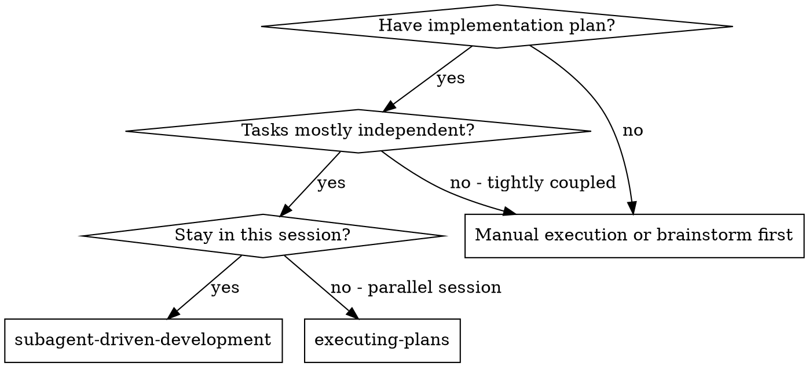
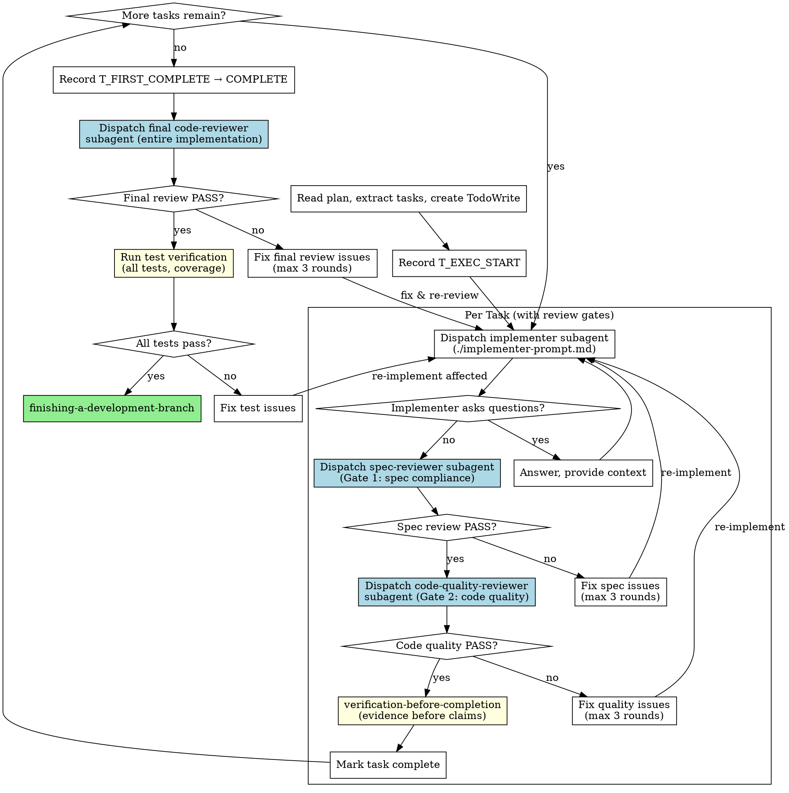

# Subagent-Driven Development

## Skill 标识

- Skill name: `subagent-driven-development`
- Plugin: `cospowers-tdd-development`
- Scope: Independent split plugin package `cospowers-tdd-development-plugin`
- Entry skill: `tdd-implementation`


**Skill 标识**: `subagent-driven-development`

其他 skill 通过 `subagent-driven-development` 引用本 skill。

Execute plan by dispatching fresh subagent per task, with two-stage review after each: spec compliance review first, then code quality review. Each review stage has mandatory gates and retry loops.

**Why subagents:** You delegate tasks to specialized agents with isolated context. By precisely crafting their instructions and context, you ensure they stay focused and succeed at their task. They should never inherit your session's context or history -- you construct exactly what they need.

**Core principle:** Fresh subagent per task + per-task spec/code review gates + final code review + test verification = high quality, fast iteration

## When to Use



## The Process



**Core principle:** Fresh subagent per task + per-task spec/code review gates + final code review + test verification = high quality, fast iteration

### Plan Test-Case Gate

Before dispatching any implementer subagent, inspect the current plan task. It must contain a `Test Cases` section with at least one executable case, expected assertions, test target, and command.

If the section is missing, vague, or only says "write tests": STOP. Do not implement. Return to `writing-plans` to repair the plan, because execution without test cases breaks task closure.

## ⏱️ Time-Stats Logging (MANDATORY)

subagent-driven-development 启动后必须在两个关键时间点追加写入 `time-stats.log`：

### T_EXEC_START: After loading plan, before first task

```bash
echo "T_EXEC_START: $(date '+%Y-%m-%d %H:%M:%S')" >> docs/agent-rules/spec_developer/output/time-stats.log
```

### T_FIRST_COMPLETE: After all tasks complete, before COMPLETE handoff

```bash
echo "T_FIRST_COMPLETE: $(date '+%Y-%m-%d %H:%M:%S')" >> docs/agent-rules/spec_developer/output/time-stats.log
```

> ⚠️ 此文件由 planner 创建（写入 T_TASK_START），executor 追加写入，最终由 committer 读取用于生成 `[TIME-STATS]` 块。三个角色通过此文件传递时间数据，**不可跳过任何打点**。

## Model Selection

Use the least powerful model that can handle each role to conserve cost and increase speed.

| Role | Model |
|------|-------|
| Implementer (1-2 files, complete spec) | cheap model |
| Implementer (multi-file, integration) | standard model |
| Implementer (design judgment, broad codebase) | most capable model |
| Spec reviewer | standard model |
| Code quality reviewer | standard model |
| Final code reviewer | standard model |

## Handling Implementer Status

**DONE:** Proceed to Gate 1 (spec-reviewer subagent).
**DONE_WITH_CONCERNS:** Read concerns. If about correctness → treat as issues to fix before review. If observations → note them, proceed to Gate 1.
**NEEDS_CONTEXT:** Provide missing context and re-dispatch implementer.
**BLOCKED:** Assess blocker -- provide context, use more capable model, break task smaller, or escalate to user.

## Per-Task Review Gates

After implementer finishes a task, dispatch two reviewer subagents in sequence. Each is a **hard gate** — the task is NOT complete until both pass.

### Gate 1: Spec Compliance Review

1. Dispatch spec-reviewer subagent using `./spec-reviewer-prompt.md`
2. Spec reviewer verifies: implementation matches requirements (nothing missing, nothing extra, no misunderstandings)
3. **Gate outcomes:**
   - **PASS** → proceed to Gate 2 (Code Quality Review)
   - **FAIL** → reviewer lists specific issues with file:line references → fix issues → re-dispatch implementer → re-dispatch spec-reviewer (max 3 rounds per task)
4. After 3 FAIL rounds: `AskUserQuestion` for human intervention

### Gate 2: Code Quality Review

1. **Only dispatch after Gate 1 PASSES**
2. Dispatch code-quality-reviewer subagent using `./code-quality-reviewer-prompt.md`
3. Code quality reviewer checks: code structure & architecture, test quality, scenario coverage, fault tolerance, comment quality. **Coding standards (E-rules, language conventions) are enforced by code-compliance-check — NOT re-checked here.** (see `./code-quality-reviewer-prompt.md` for full scope)
4. **Gate outcomes:**
   - **PASS** → proceed to code-compliance-check (below)
   - **FAIL** → reviewer lists specific issues with file:line references → fix issues → re-dispatch implementer → re-dispatch code-quality-reviewer (max 3 rounds per task)
5. After 3 FAIL rounds: `AskUserQuestion` for human intervention

### Code Compliance Check (KB Standards)

After Gate 2 passes, run the unified coding standards check:

1. Run `code-compliance-check` skill (KB semantic check → lint auto-fix)
2. Violations block commit
3. On pass, writes `compliance-cache.json`

> This is the single authoritative coding standards check. It covers E-rules, language conventions, naming, formatting, security, logging, error handling — everything that was previously split across red-line self-checks and Gate 2 E-rules checks.

### Verification Before Completion

After code-compliance-check passes:
- Invoke `verification-before-completion` (run tests, show evidence)
- Mark task complete in TodoWrite

### Per-Task Retry Loop

```
implementer → spec-reviewer → PASS? ──yes→ code-quality-reviewer → PASS? ──yes→ code-compliance-check → PASS? ──yes→ verification-before-completion → mark complete
                  │no                            │no                              │no
                  ↓                              ↓                                ↓
              fix issues                    fix issues                      fix issues
                  │                              │                                │
                  └── retry (max 3) ────────→ retry (max 3) ──────────────→ retry (max 3)
```

## Post-Completion: Final Review + Test Verification

After ALL tasks pass both review gates and are marked complete:

1. Record `T_FIRST_COMPLETE` time-stat (see Time-Stats Logging above)
2. Output `COMPLETE` marker
3. **Dispatch final code-reviewer subagent** for the entire implementation:
   - Use `./final-code-reviewer-prompt.md` (cross-task concerns checklist)
   - Scope: `git diff <plan-start-commit>..HEAD` — all tasks combined
   - Focus: architecture consistency, cross-task data flow, style uniformity, overall code health, requirements-design coherence, cross-task DFX — issues invisible to per-task reviewers
   - **Gate**: PASS → proceed to test verification. FAIL → fix → re-dispatch final reviewer (max 3 rounds)
4. Execute test verification:
   - Run all unit tests: `pytest tests/ -v` or `go test ./... -v`
   - Run API tests if applicable
   - Verify normal + boundary + exception scenario coverage
   - Record results in tasks.md (`## 测试验证记录` section)
5. **Gate:** All pass → finishing-a-development-branch. Failures → fix → restart from affected task's Gate 1 (max 3 full rounds).
6. If issues persist after 3 rounds: `AskUserQuestion` for human intervention.

## Prompt Templates

- `./implementer-prompt.md` - Dispatch implementer subagent
- `./spec-reviewer-prompt.md` - Dispatch spec compliance reviewer subagent (Gate 1)
- `./code-quality-reviewer-prompt.md` - Dispatch code quality reviewer subagent (Gate 2)
- `./final-code-reviewer-prompt.md` - Dispatch final code-reviewer subagent (Post-Completion, cross-task review)

## Red Flags

**Never:**
- Start implementation on main/master branch without explicit user consent
- Skip review gates after task implementation (both gates + code-compliance-check are MANDATORY)
- Skip final code review after all tasks complete
- Dispatch code-quality-reviewer before spec-reviewer PASSES
- Accept reviewer FAIL without fixing and re-dispatching
- Skip code-compliance-check after Gate 2 PASS
- Skip verification-before-completion after code-compliance-check PASS
- Implement a task whose plan lacks executable `Test Cases`
- Exceed 3 retry rounds without escalating to user
- Dispatch multiple implementation subagents in parallel (conflicts)
- Make subagent read plan file (provide full text instead)
- Skip scene-setting context (subagent needs to understand where task fits)
- Ignore subagent questions (answer before letting them proceed)
- Move to finishing-a-development-branch before all checks pass

**If subagent asks questions:**
- Answer clearly and completely
- Provide additional context if needed
- Don't rush them into implementation

**If reviewer finds issues:**
- Fix issues
- Re-dispatch implementer with fixes
- Re-dispatch reviewer to verify
- Repeat until PASS (max 3 rounds per gate)
- Don't skip the re-review

## Integration

**Required workflow skills:**
- **using-git-worktrees** - REQUIRED: Set up isolated workspace before starting
- **writing-plans** - Creates the plan this skill executes
- **verification-before-completion** - REQUIRED: Evidence before marking task complete (after Gate 2 PASS)
- **requesting-code-review** - Code review template for reviewer subagents (Gate 2 + Final review)
- **finishing-a-development-branch** - Complete development after verification

**Subagents should use:**
- **test-driven-development** - Subagents follow TDD for each task
- **spec-commit** - Implementer subagent commits follow structured commit format
